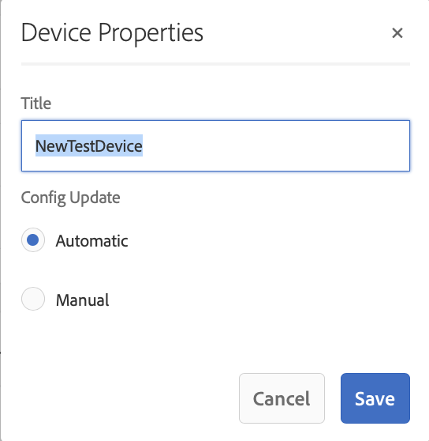

# Risoluzione dei problemi del centro di controllo del dispositivo {#troubleshooting-device-control-center}

Puoi monitorare e risolvere i problemi di prestazioni per l&#39;attività del lettore e il dispositivo Screens utilizzando il dashboard del dispositivo. Questa pagina fornisce informazioni su come monitorare e risolvere problemi di prestazioni percepite per il lettore Screens e i dispositivi assegnati.

## Monitoraggio e risoluzione dei problemi dal Centro di controllo del dispositivo {#monitor-and-troubleshoot-from-device-control-center}

È possibile monitorare l&#39;attività e quindi risolvere i problemi del lettore Screens, utilizzando Device Dashboard.

### Pannello dispositivo {#device-dashboard}

Seguite i passaggi riportati di seguito per passare al dashboard del dispositivo:

1. Andate al dashboard del dispositivo dal progetto, ad esempio ***Test Project*** —> ***Devices***.

   Selezionare **Devices** e **Device Manager** dalla barra delle azioni.

   

1. Nell&#39;elenco vengono visualizzati i dispositivi assegnati e non assegnati, come illustrato nella figura riportata di seguito.

   

1. Selezionare il dispositivo (**NewTestDevice**) e fare clic su **Dashboard** dalla barra delle azioni.

   

1. La pagina mostra le informazioni sul dispositivo, l&#39;attività e i dettagli del dispositivo che consentono di monitorare le attività e le funzioni del dispositivo.

   

### Monitoraggio dell&#39;attività del dispositivo {#monitor-device-activity}

Il pannello **Attività** mostra l&#39;ultimo ping del lettore di schermate con la marca temporale. L&#39;ultimo ping corrisponde all&#39;ultima volta che il dispositivo ha contattato il server.

Inoltre, fate clic su **Raccogli registri** dall&#39;angolo in alto a destra del pannello **Attività** per visualizzare i registri del lettore.

### Aggiorna dettagli dispositivo {#update-device-details}

Controllare il pannello **Device Details** per visualizzare l&#39;IP del dispositivo, l&#39;utilizzo dello storage, la versione del firmware e il tempo di attività del lettore.

Inoltre, fare clic su **Cancella cache** e **Aggiorna** per cancellare la cache del dispositivo e aggiornare la versione [firmware](screens-glossary.md) rispettivamente da questo pannello.

Inoltre, fare clic su **...** dall&#39;angolo superiore destro del pannello **Dettagli dispositivo** per riavviare o aggiornare lo stato del lettore.

### Aggiorna informazioni dispositivo {#update-device-information}

Controllare il pannello **INFORMAZIONI DISPOSITIVO** per visualizzare l&#39;aggiornamento della configurazione, il modello di dispositivo, il sistema operativo del dispositivo e le informazioni sulla shell.

Inoltre, fare clic su (**...**) dall&#39;angolo superiore destro del pannello Informazioni dispositivo per visualizzare le proprietà o aggiornare il dispositivo.

Fare clic su **Proprietà** per visualizzare la finestra di dialogo **Proprietà dispositivo**. È possibile modificare il titolo del dispositivo o scegliere l&#39;opzione per gli aggiornamenti di configurazione come **Manual** o **Automatic**.

>[!NOTE]
>
>Per ulteriori informazioni sugli eventi associati agli aggiornamenti automatici o manuali del dispositivo, vedere la sezione ***Aggiornamenti automatici o manuali dal Pannello del dispositivo*** in [Gestione dei canali](managing-channels.md).

### Visualizza schermata lettore {#view-player-screenshot}

È possibile visualizzare lo screenshot del lettore dal dispositivo dal pannello **PLAYER SCREENSHOT**.

Fare clic su (**...**) nell&#39;angolo superiore destro del pannello Screenshot del lettore e selezionare **Aggiorna screenshot** per visualizzare lo snapshot del lettore in esecuzione.

### Gestisci preferenze {#manage-preferences}

Il pannello **PREFERENZE** consente all&#39;utente di modificare le preferenze per **Admin UI**, **Channel Switcher** e **Remote Debugging** per il dispositivo.

>[!NOTE]
>Per ulteriori informazioni su queste opzioni, vedere [ AEM Screens Player](working-with-screens-player.md).

Inoltre, fate clic su **Impostazioni** nell&#39;angolo in alto a destra per aggiornare le preferenze del dispositivo. Potete aggiornare le seguenti preferenze:

* **URL server**
* **Risoluzione**
* **Riavvia pianificazione**
* **N. max dei file di registro da mantenere**
* **Livello registro**

>[!NOTE]
>È possibile selezionare uno dei seguenti livelli di registro:
>* **Disattiva**
>* **Debug**
>* **Info**
>* **Avvertenza**
>* **Errore**

## Risoluzione dei problemi relativi alle impostazioni OSGi {#troubleshoot-osgi-settings}

È necessario abilitare il referente vuoto per consentire al dispositivo di inviare dati al server. Ad esempio, se la proprietà del referente vuoto è disabilitata, il dispositivo non può inviare una schermata indietro.

Attualmente alcune di queste funzioni sono disponibili solo se il filtro *Apache Sling Referrer Filter Allow Empty* è abilitato nella configurazione OSGi. Il dashboard potrebbe visualizzare un avviso che segnala che le impostazioni di protezione potrebbero impedire il funzionamento di alcune di queste funzioni.

Seguite i passaggi riportati di seguito per attivare il filtro Apache Sling Referrer Consenti vuoto

1. Andate a **Configurazione console Web Adobe Experience Manager**, ovvero `https://localhost:4502/system/console/configMgr/org.apache.sling.security.impl.ReferrerFilter`.
1. Selezionare l&#39;opzione **allow.empty**.
1. Fai clic su **Salva**.

### Consigli {#recommendations}

La sezione seguente raccomanda di monitorare i collegamenti di rete, il server e i lettori per comprendere lo stato e reagire ai problemi.

AEM fornisce un monitoraggio integrato per:

* *Heartbeatbeatogni 5 secondi per indicare che il  AEM Screens Player è in funzione.* 
* *Schermata* del lettore che mostra ciò che è attualmente visualizzato sul lettore.
* La versione *AEM Screens Player Firmware* installata sul lettore.
* *Spazio di archiviazione gratuito* sul lettore.

Recommendations per il monitoraggio remoto con software di terze parti:

* Utilizzo della CPU sui lettori.
* Verificare  processo di AEM Screens Player in esecuzione.
* Riavvio/riavvio remoto del lettore.
* Notifiche in tempo reale.

Si consiglia di implementare l&#39;hardware e il sistema operativo Player in modo da consentire il login remoto per diagnosticare i problemi e riavviare il lettore.

#### Risorse aggiuntive {#additional-resources}

Consultate [Configurazione e risoluzione dei problemi di riproduzione video](troubleshoot-videos.md) per eseguire il debug e risolvere i problemi relativi alla riproduzione di video nel canale.
