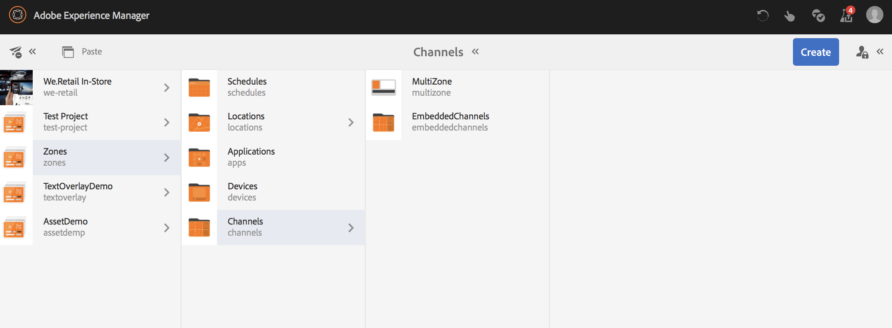
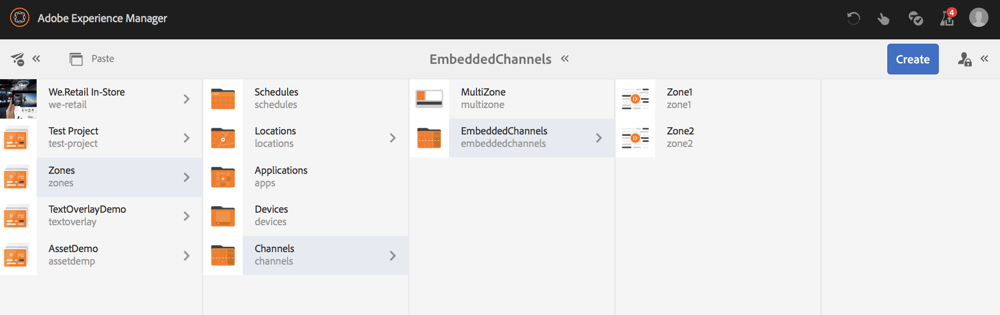

# Layout multizona {#multi-zone-layout}

La pagina seguente descrive l&#39;utilizzo del layout multizona e tratta i seguenti argomenti:

* Panoramica
* Creazione di un layout multizona
* Prerequisiti
* Utilizzo di un singolo Assets in una o più aree
* Utilizzo di contenuti in sequenza in una o più aree

## Panoramica {#overview}

***Layout multizona*** consente di creare contenuti per più aree e di utilizzare varie risorse, quali video, immagini e testo, che possono essere combinate in un&#39;unica schermata. Puoi richiamare immagini, video e testo per unire le diverse caratteristiche e creare un’esperienza digitale intuitiva.

In base alle esigenze del progetto, a volte è necessario disporre di più zone in un canale e modificarle come un&#39;unica unità completa. Ad esempio, una sequenza di prodotto con un feed di social media correlato che viene eseguita in tre aree separate su un singolo canale.

>[!NOTE]
>Nei canali multizona, la pianificazione a livello di risorsa non è consigliata a causa di potenziali conflitti e comportamenti non desiderati. Se è necessaria una pianificazione a livello di risorsa, crea un canale di sequenza separato e applica una logica di pianificazione all’interno di tale canale. Quindi, incorpora il canale della sequenza nel canale multizona.

### Prerequisiti {#prerequisites}

Prima di iniziare a implementare questa funzionalità, assicurati di disporre delle conoscenze concettuali su:

* [Creazione di un progetto AEM Screens](https://experienceleague.adobe.com/en/docs/experience-manager-screens/user-guide/authoring/setting-up-projects/creating-a-screens-project)
* [Creazione di una visualizzazione](https://experienceleague.adobe.com/en/docs/experience-manager-screens/user-guide/authoring/setting-up-projects/managing-displays)
* [Assegnazione di un canale a una visualizzazione](/help/user-guide/channel-assignment.md)

## Creazione di un layout multizona {#creating-multi-zone-layout}

Durante la creazione di un canale, puoi utilizzare diversi modelli per creare zone nel canale. Puoi aggiungere una singola immagine, un video o un canale incorporato per visualizzare più risorse in una sequenza.

**Creazione di un canale**

1. Fai clic sul collegamento Adobe Experience Manager (in alto a sinistra) e quindi su **Screens**. In alternativa, è possibile passare direttamente a: `http://localhost:4502/screens.html/content/screens`.
1. Passa alla cartella **Canali** e fai clic su **Crea** nella barra delle azioni.

1. Fare clic su **1x2 canale schermo diviso** dalla procedura guidata **Crea**.

1. Fai clic su **Avanti** e immetti il **titolo** come **MultiZone**.

1. Fai clic su **Crea** per completare la creazione del canale.

### Utilizzo di un singolo Assets in una o più aree {#using-single-assets-in-one-or-more-zones}

Puoi utilizzare risorse singole, come un’immagine o un video, in tutte le singole aree. Per l’implementazione, segui i passaggi seguenti:

1. **Aggiunta di contenuto al canale**

   1. Passa a **Zone** > **Canali**> **MultiZone**.
   1. Fai clic sul canale **MultiZone** e fai clic su **Modifica** nella barra delle azioni.

1. **Aggiunta di immagini al canale**

   Per riprodurre una singola immagine o un video in due zone, è sufficiente trascinare un’immagine in ciascuna zona dell’editor canali, come illustrato nella figura seguente:

   

### Utilizzo di contenuti in sequenza in una o più aree {#using-sequenced-content-in-one-or-more-zones}

Se desideri che le aree visualizzino una sequenza di immagini e un video nelle diverse aree, segui i passaggi riportati di seguito per i dettagli.

1. **Creazione di una cartella canali**

   1. Passa a **Zone** > **MultiZone** > **Canali** e fai clic su **Crea** nella barra delle azioni.
   1. Fare clic su **Cartella canali** dalla procedura guidata **Crea** e fare clic su **Avanti**.
   1. Immetti il titolo come **EmbeddedChannels** e fai clic su **Crea**.

   

1. **Aggiunta di altri due canali alla cartella canali**

   1. Passa a **Zone** > **Canali** > **Canali incorporati** e fai clic su **Crea** nella barra delle azioni.
   1. Fare clic su **Canale sequenza** dalla procedura guidata **Crea** per creare un canale con titolo **`Zone1`**.
   1. Fai clic su **`Zone1`** e poi su **Modifica** nella barra delle azioni.
   1. Trascina alcune immagini su questo canale.
   1. Analogamente, creare un altro canale di sequenza con titolo **`Zone2`** nella cartella **EmbeddedChannels**.
   1. Trascina un video su questo canale.

   Nella figura seguente sono illustrati i canali **`Zone1`** e **`Zone2`**:

   

   Le immagini aggiunte all&#39;editor del canale di sequenza **`Zone1`** sono mostrate di seguito:

   

   Il video aggiunto all&#39;editor del canale di sequenza **`Zone2`** è mostrato di seguito:

   

1. **Aggiunta di sequenze incorporate (componente) al canale principale (MultiZone)**

   1. Passa a **Zone** > **Canali** > **MultiZone**.
   1. Fai clic su **Modifica** nella barra delle azioni.
   1. Trascina e rilascia il componente **Sequenza incorporata** in entrambe le zone.
   1. Fate clic sulla sequenza incorporata in una delle zone.
   1. Fai clic sull&#39;icona **Configura** (chiave inglese) per inserire una delle sequenze incorporate nell&#39;editor.
   1. Fai clic sul percorso del canale come **Zone** > **Canali** > **Canali incorporati** > **`Zone1`**, come illustrato nella figura seguente.
   1. Allo stesso modo, aggiungi **`Zone2`** a un altro componente di sequenza incorporato nell&#39;editor.

      

### Creazione di una posizione e di una visualizzazione {#creating-location}

Crea una posizione e una visualizzazione per visualizzare il contenuto in AEM Screens Player.

1. **Creazione di un percorso**

   1. Passa alla cartella **Zone** > **Posizioni**.
   1. Fai clic sulla cartella **Percorsi** e fai clic su **Crea** nella barra delle azioni.
   1. Fai clic su **Posizione** nella procedura guidata **Crea** e fai clic su **Avanti**.
   1. Immetti il **Titolo** come **SanJose** e fai clic su **Crea**.

1. **Creazione di una visualizzazione**

   1. Passa alla cartella **Zone** > **Posizioni**.
   1. Fai clic sul percorso **SanJose** e fai clic su **Crea** nella barra delle azioni.
   1. Fare clic su **Visualizza** dalla procedura guidata **Crea** e fare clic su **Avanti**.
   1. Immetti il **Titolo** come **Lobby** e fai clic su **Crea**.

### Assegnazione di canali alla visualizzazione {#channel-channel}

Assegna i canali alla visualizzazione per visualizzare il contenuto. Per assegnare il canale al display, segui la procedura riportata di seguito.

1. **Assegnazione del canale alla visualizzazione**

   1. Passa a **Zone** > **Posizioni** > **SanJose**> **Lobby**.
   1. Fai clic sulla visualizzazione **Lobby** e fai clic su **Assegna canale** nella barra delle azioni.
   1. Immettere il percorso del canale **MultiZone** in **Percorso canale**.
   1. Imposta **Eventi supportati** come **Caricamento iniziale**, **Schermata di inattività** e **Timer**.
   1. Fai clic su **Salva**.

      
   1. Allo stesso modo, assegnare gli altri due canali incorporati (**`Zone1`** e **`Zone2`**) a questa visualizzazione.
   1. Dopo aver assegnato tutti e tre i canali alla visualizzazione **Lobby**, dovresti essere in grado di visualizzare i canali assegnati dal dashboard di visualizzazione.

      

      >[!IMPORTANT]
      >
      >Dopo aver assegnato il canale principale (in questo caso, **MultiZone**) alla visualizzazione, è necessario assegnare anche gli altri due canali incorporati **`Zone1`** e **`Zone2`** alla stessa visualizzazione.

### Registrazione del dispositivo {#registering-device}

Dopo aver impostato una posizione e uno schermo, attenersi alla procedura riportata di seguito per registrare il dispositivo e assegnargli lo schermo.

1. **Registrazione del dispositivo**

   1. Passare alla cartella **Zone** > **Dispositivi**.
   1. Fare clic sulla cartella **Dispositivi** e fare clic su **Gestione dispositivi** nella barra delle azioni.
   1. Fare clic su **Registrazione dispositivo** e selezionare il dispositivo in sospeso dall&#39;elenco.

      >[!NOTE]
      > Il titolo del dispositivo deve corrispondere al token del dispositivo (campo **Token**) visualizzato nella scheda **Registrazione dispositivo**.

   1. Se il titolo corrisponde al token del dispositivo, fare clic sul dispositivo e quindi su **Registra dispositivo** nella barra delle azioni.
   1. Se il codice di registrazione corrisponde al codice della scheda Registrazione dispositivo **del lettore Screens**, fare clic su **Convalida** nella barra delle azioni.
      
   1. Immetti **Titolo** come **`Chrome-Device1`** e fai clic su **Registra**.
   1. Fare clic su **Assegna visualizzazione** e quindi sul percorso della configurazione del dispositivo.

   >[!NOTE]
   >Se stai tentando di visualizzare il contenuto nel lettore Screens, accertati di fare clic su **Aggiorna contenuto offline** dal dashboard dei canali per ciascuno dei canali assegnati alla visualizzazione.

### Visualizzazione del risultato {#viewing-the-result}

Quando si implementano layout multizona utilizzando i passaggi precedenti, viene visualizzato il seguente output.

Controlla il lettore Screens in modo da poter visualizzare l’output che mostra il contenuto in due aree diverse. Le zone sinistra e destra (entrambe utilizzano una sequenza incorporata come componente).

La zona sinistra è un canale di sequenza e la zona destra include un video.

