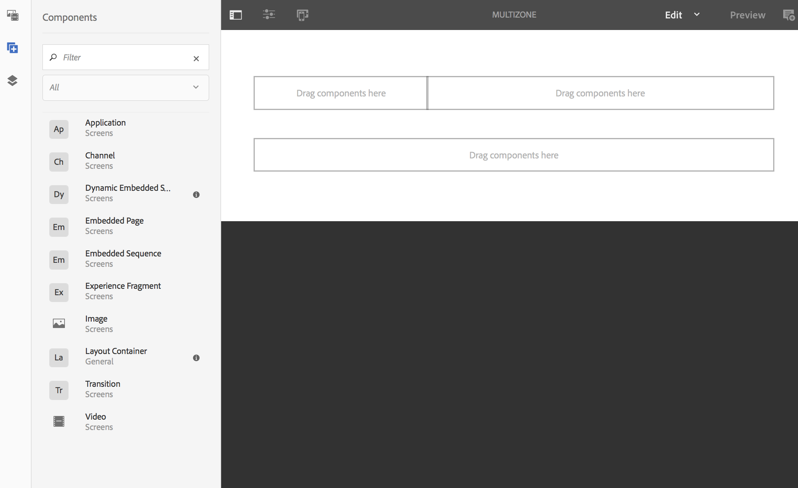

# Layout con più aree {#multi-zone-layout}

La pagina seguente descrive l’utilizzo del layout a più zone e illustra i seguenti argomenti:

* Panoramica
* Creazione di un layout con più aree
* Prerequisiti
* Utilizzo di risorse singole in una o più aree
* Utilizzo del contenuto sequenziale in una o più aree

## Panoramica {#overview}

***Layout*** con più aree consente di creare contenuti con più aree e di utilizzare una varietà di risorse come video, immagini e testo che possono essere combinati in un unico schermo. Potete inserire immagini, video e testo per fonderli e creare un&#39;esperienza digitale intuitiva.

In base ai requisiti del progetto, talvolta è necessario disporre di più aree in un canale e modificarle come un’unica unità. Ad esempio, una sequenza del prodotto con il relativo feed social media in esecuzione in tre aree distinte su un singolo canale.

## Creazione di un layout con più aree {#creating-multi-zone-layout}

Durante la creazione di un canale, potete usare diversi modelli per creare aree nel vostro canale. Potete aggiungere una singola immagine, un video o un canale incorporato che consenta la visualizzazione di più risorse in una sequenza.

### Prerequisiti {#prerequisites}

Prima di iniziare ad implementare questa funzionalità, assicuratevi di disporre di un progetto pronto come prerequisito per iniziare a implementare il layout multizona. Ad esempio,

* Creare un progetto AEM Screens denominato **AEM Screens**
* Creare una visualizzazione in **Posizioni** denominate **MultiZoneDisplay**

Create un canale denominato **MultiZone** nel progetto **Zone** . Effettuate le seguenti operazioni:

**Creazione del canale**

1. Seleziona il collegamento all’Adobe Experience Manager (in alto a sinistra) e quindi **Schermi**. Alternatively, you can go directly to: `http://localhost:4502/screens.html/content/screens`.
1. Andate alla cartella **Canali** e fate clic su **Crea** dalla barra delle azioni.

1. Selezionate **Barra L a sinistra Dividi canale** schermo dalla procedura guidata **Crea** .

1. Fate clic su **Avanti** e immettete il **titolo** come **MultiZone**.

1. Fate clic su **Crea** per completare la creazione del canale.

### Utilizzo di risorse singole in una o più aree {#using-single-assets-in-one-or-more-zones}

Potete usare singole risorse, ad esempio un’immagine o un video, in tutte e tre le aree. Seguite i passaggi indicati di seguito per l&#39;implementazione:

1. **Aggiunta di contenuti al canale**

   1. Passare a **Aree** —> **Canali**—>**Zonamultipla**.
   1. Select the **MultiZone** channel and click **Edit** from the action bar to open the editor.
   

1. **Aggiunta di immagini al canale**

   Per riprodurre una singola immagine o un video in tutte e tre le aree, trascinate e rilasciate l’immagine nell’editor canale, come mostrato di seguito.

   

### Utilizzo del contenuto sequenziale in una o più aree {#using-sequenced-content-in-one-or-more-zones}

Per visualizzare la sequenza di immagini o contenuti e un&#39;immagine statica nelle aree desiderate, attenetevi alla seguente procedura per ulteriori dettagli.

1. **Creazione di una cartella canale**

   1. Passate alle **aree** —> **MultiZone** —> **Canali** e fate clic su **Crea** dalla barra delle azioni.
   1. Select **Channels Folder** from the **Create** wizard and click **Next**.
   1. Enter the title as **EmbeddedChannels** and click **Create**.
   

1. **Aggiunta di altri due canali alla cartella Canale**

   1. Andate a **Aree** —> **Canali** —> **Canali** incorporati e fate clic su **Crea** dalla barra delle azioni.
   1. Selezionate Canale **** sequenza dalla procedura guidata **Crea** per creare un canale denominato **Zona1**.
   1. Select **Zone1** and click **Edit** from the action bar to open the editor.
   1. Trascinate alcune immagini su questo canale.
   Analogamente, create un altro canale di sequenza denominato **Zone2** nella cartella **EmbeddedChannels** .

   

   Le immagini aggiunte all&#39;editor del canale della sequenza **Zone1** sono mostrate di seguito:

   

   Le immagini aggiunte all&#39;editor del canale della sequenza **Zone2** sono mostrate di seguito:

   

1. **Aggiunta di sequenze/componenti incorporati al canale principale (MultiZone)**

   1. Passare a **Aree** —> **Canali** —> **Zona** multipla.
   1. Fai clic su **Modifica** nella barra delle azioni per aprire l&#39;editor.
   1. Trascinate e rilasciate il componente Sequenza **** incorporata in due delle zone.

1. **Aggiungere contenuto a tutte e tre le aree**

   1. Passare a **Aree** —> **Canali** —> **Zona** multipla.
   1. Selezionare la sequenza incorporata in una delle zone.
   1. Fate clic sull&#39;icona **Configura** (chiave inglese) per passare a una delle sequenze incorporate nell&#39;editor.
   1. Selezionate il percorso del canale come **Aree** —> **Canali** —> **IncorporatiCanali** —> **Zona1**, come illustrato nella figura seguente.
   Allo stesso modo, aggiungete la **Zona2** a un altro componente della sequenza incorporata nell’editor.

   

#### Visualizzazione del risultato {#viewing-the-result}

Una volta implementati i layout con più aree utilizzando i passaggi precedenti, viene visualizzato il seguente output, come illustrato nella figura riportata di seguito.

Il seguente output in Screens Player visualizza il contenuto in tre aree diverse. Nelle zone a sinistra e a destra (entrambe utilizzano la sequenza incorporata come componente) viene visualizzata una sequenza di immagini e nella zona sottostante viene visualizzata un’immagine statica.

