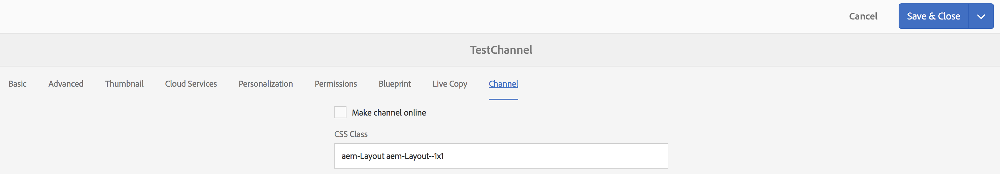
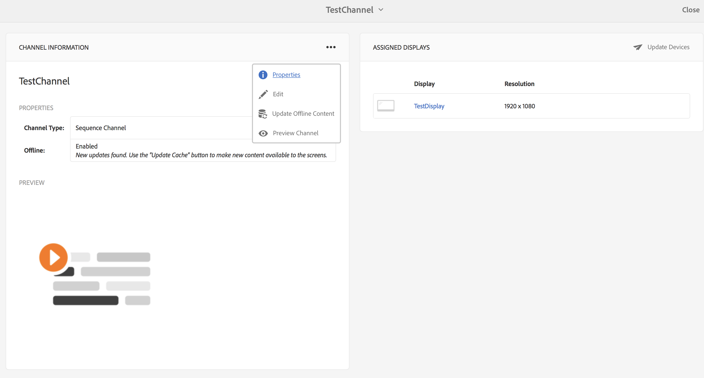
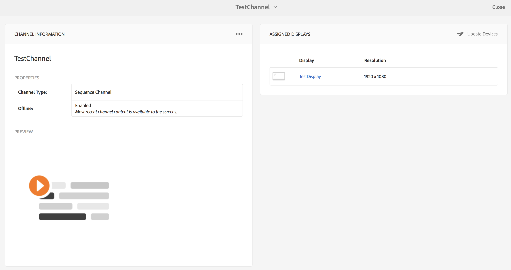
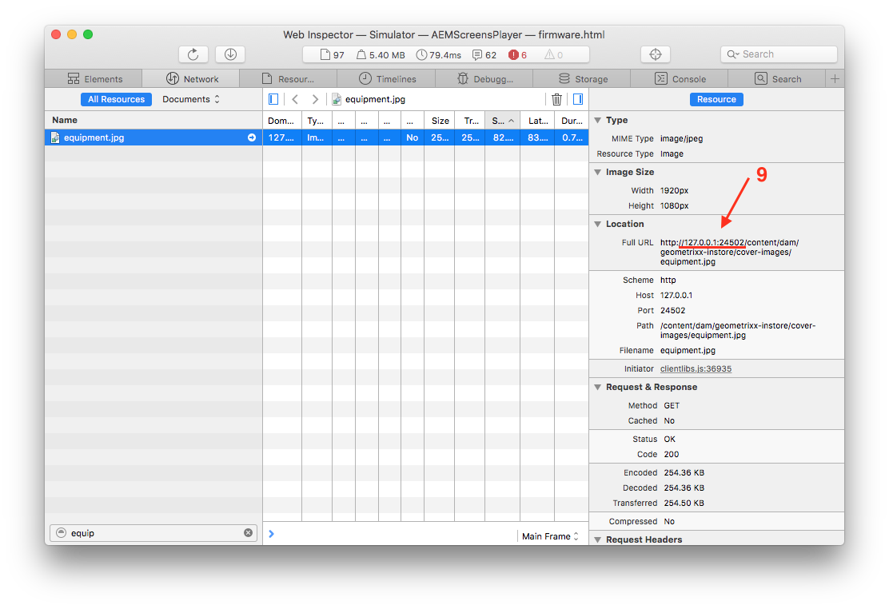

# Canali offline {#offline-channels}

>[!IMPORTANT]
>Questo contenuto è valido per AEM on-premise/AMS (AEM 6.5LTS e AEM 6.5). Per i contenuti di AEM as a Cloud Service Screens, consulta la [guida di AEM as a Cloud Service](https://experienceleague.adobe.com/en/docs/experience-manager-cloud-service/content/screens-as-cloud-service/overview/introduction).

Il lettore Screens fornisce supporto offline per i canali utilizzando la tecnologia ***ContentSync***.

I lettori utilizzano un server http locale per distribuire il contenuto decompresso.

Quando un canale è configurato per l&#39;esecuzione di *online*, il lettore fornisce le risorse del canale accedendo al server AEM. Tuttavia, quando il canale è configurato per l&#39;esecuzione di *offline*, il lettore fornisce le risorse del canale da un server http locale.

Il flusso di lavoro per il processo è il seguente:

1. Analizza le pagine desiderate.
1. Raccogli tutte le risorse correlate.
1. Crea il pacchetto di tutto in un file zip.
1. Scarica lo zip ed estrailo localmente.
1. Visualizza una copia locale del contenuto.

## Gestori aggiornamenti {#update-handlers}

***ContentSync*** utilizza gestori di aggiornamenti per analizzare e raccogliere tutte le pagine e le risorse necessarie per un progetto specifico. AEM Screens utilizza i seguenti gestori di aggiornamenti:

### Opzioni comuni {#common-options}

* *type*: il tipo di gestore di aggiornamento da utilizzare
* *percorso*: percorso della risorsa
* *[targetRootDirectory]*: cartella di destinazione nel file zip

<table>
 <tbody>
  <tr>
   <td><strong>Tipo</strong></td> 
   <td><strong>Descrizione</strong></td> 
   <td><strong>Opzioni</strong></td> 
  </tr>
  <tr>
   <td><code>channels</code></td> 
   <td>raccoglie un canale</td> 
   <td>estensione: estensione della risorsa da raccogliere  [pathSuffix='']: suffisso da aggiungere al percorso del canale  </td> 
  </tr>
  <tr>
   <td><code>clientlib</code></td> 
   <td>raccogliere la libreria client specificata</td> 
   <td>[extension='']: può essere css o js, per raccogliere solo il primo, o solo il secondo</td> 
  </tr>
  <tr>
   <td><code>assetrenditions</code></td> 
   <td>raccogliere le rappresentazioni della risorsa</td> 
   <td>[renditions=[]]: elenco di rendering da raccogliere. Valore predefinito per la rappresentazione originale</td> 
  </tr>
  <tr>
   <td><code>copy</code></td> 
   <td>copia la struttura specificata dal percorso</td> 
   <td> </td> 
  </tr>
 </tbody>
</table>

### Verifica della configurazione ContentSync {#testing-contentsync-configuration}

Per verificare la configurazione di ContentSync, segui i passaggi seguenti:

1. Apri `https://localhost:4502/libs/cq/contentsync/content/console.html`.
1. Fai clic sulla configurazione nell’elenco.
1. Fare clic su **Cancella cache**.
1. Fare clic su **Aggiorna cache**.
1. Fare clic su **Scarica completo**.
1. Estrai il file zip.
1. Avvia un server locale nella cartella estratta.
1. Apri la pagina iniziale e controlla lo stato dell’app.

## Abilitazione della configurazione offline per un canale {#enabling-offline-config-for-a-channel}

Per abilitare la configurazione offline per un canale, effettua le seguenti operazioni:

1. Esamina il contenuto del canale e verifica se è richiesto da un’istanza di AEM (online).

   

1. Passa alla dashboard dei canali.
1. Fare clic su **...** nel pannello **INFORMAZIONI CANALE**.

   

1. Passa alle proprietà del canale.
1. Nella scheda (Canale), accertati che la casella di controllo sia disabilitata, quindi fai clic su **Salva e chiudi**.

   

   Prima che il contenuto venga distribuito correttamente nel dispositivo, fare clic su **Aggiorna contenuto offline**.

   

   Anche lo stato **Non in linea** in **PROPRIETÀ** viene aggiornato di conseguenza.

   

1. Controllare il contenuto del canale e verificare se è richiesto da Player-Cache locale.

   

>[!NOTE]
>
>Scopri il modello per i gestori di risorse offline personalizzati. Ulteriori informazioni sui requisiti minimi in `pom.xml` per il progetto. Vedi [Modello per gestori personalizzati](/help/user-guide/developing-custom-component-tutorial-develop.md#custom-handlers) in **Sviluppo di un componente personalizzato per AEM Screens**.
