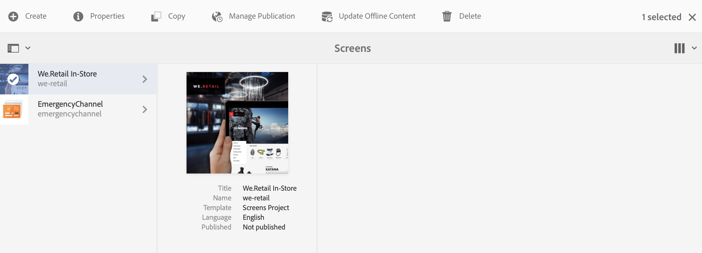

# Aggiornamento dei contenuti on-demand {#on-demand}

Questa sezione descrive i contenuti on-demand per la gestione delle pubblicazioni.

## Gestione della pubblicazione: distribuzione degli aggiornamenti dei contenuti dall’ambiente di authoring a quello di Publish al dispositivo {#managing-publication-delivering-content-updates-from-author-to-publish-to-device}

Puoi pubblicare e annullare la pubblicazione dei contenuti da AEM Screens. La funzione Gestisci pubblicazione consente di distribuire aggiornamenti di contenuto dall’ambiente di authoring a quello di pubblicazione su dispositivo. Puoi pubblicare/annullare la pubblicazione dei contenuti per l’intero progetto AEM Screens o solo per uno dei tuoi canali, posizione, dispositivo, applicazione o pianificazione.

### Gestione della pubblicazione per un progetto AEM Screens {#managing-publication-for-an-aem-screens-project}

Per distribuire gli aggiornamenti dei contenuti dall’ambiente di authoring a quello di pubblicazione su dispositivi per un progetto AEM Screens, segui i passaggi seguenti:

1. Passa al progetto AEM Screens.
1. Fai clic su **Gestisci pubblicazione** nella barra delle azioni per pubblicare il progetto nell&#39;istanza di Publish.

   

1. Verrà aperta la **Gestione guidata pubblicazione**. Puoi fare clic sull&#39;**Azione** e pianificare anche il tempo di pubblicazione per ora o in un secondo momento. Fai clic su **Avanti**.

   

1. Selezionare la casella per fare clic sull&#39;intero progetto dalla procedura guidata **`Manage Publication`**.

   

1. Fai clic su **+ Includi elementi figlio** nella barra delle azioni e deseleziona tutte le opzioni in modo da poter pubblicare tutti i moduli del progetto, quindi fai clic su **Aggiungi** per pubblicare.

   >[!NOTE]
   >
   >Per impostazione predefinita, tutte le caselle sono selezionate ed è necessario deselezionarle manualmente per pubblicare tutti i moduli del progetto.

   

   **Informazioni sulla finestra di dialogo Includi elementi figlio**

   I passaggi indicati sopra mostrano come pubblicare l’intero contenuto. Se desideri utilizzare le altre tre alternative disponibili, seleziona quella particolare opzione.
Ad esempio, l’immagine seguente mostra come gestire e aggiornare solo le pagine modificate nel progetto:
   

   Segui le spiegazioni riportate di seguito per comprendere le opzioni disponibili:

   1. **Includi solo elementi figlio di primo livello**:
Questa opzione consente di gestire gli aggiornamenti solo ai sottonodi nella struttura del progetto.
   1. **Solo pagine modificate**:
Questa opzione consente di gestire gli aggiornamenti solo alle pagine modificate del progetto in cui le modifiche si trovano nella struttura del progetto.
   1. **Includi solo pagine già pubblicate**:
Questa opzione consente di gestire gli aggiornamenti solo per le pagine precedentemente pubblicate.

1. Da **`Manage Publication wizard`**, fare clic su **Publish**.

   

   >[!NOTE]
   >
   >Attendi alcuni secondi/minuti in modo che il contenuto raggiunga l’istanza di pubblicazione.
   >
   >
   >    1. Il flusso di lavoro non funziona se nel progetto non sono presenti modifiche e nulla per **Aggiorna contenuto offline**.
   >    1. Il flusso di lavoro non funzionerà se l&#39;autore non completa il processo di replica (i contenuti sono ancora in fase di caricamento nell&#39;istanza di pubblicazione) dopo aver selezionato il pulsante **Publish** nel flusso di lavoro di gestione della pubblicazione.

   >[!CAUTION]
   >In qualità di creatore di contenuti, se desideri visualizzare le modifiche nei dispositivi collegati all&#39;istanza di authoring, fai clic su **Aggiorna contenuto offline** dal dashboard dei canali o selezionando il progetto. In questo caso, l’aggiornamento del contenuto offline viene eseguito solo nell’istanza di authoring.

1. Passare al progetto e fare clic su **Aggiorna contenuto offline** nella barra delle azioni. Questa azione inoltra lo stesso comando all’istanza Publish, in modo che i file ZIP non in linea vengano creati anche nell’istanza Publish.

   

   >[!NOTE]
   >
   >Dopo aver completato il flusso di lavoro di gestione della pubblicazione e se un lettore punta all’istanza Autore, attiva l’aggiornamento del contenuto offline nell’istanza Autore. In questo modo l’aggiornamento viene creato offline nell’istanza di authoring.

   >[!CAUTION]
   >
   >Attiva l’aggiornamento dei contenuti offline nell’istanza di authoring, se hai un lettore registrato nel server di authoring. Non è necessario aggiornare il contenuto offline per il lettore registrato nell’istanza Publishing.

### Gestione della pubblicazione per un canale {#managing-publication-for-a-channel}

Segui i passaggi seguenti per fornire aggiornamenti dei contenuti da Autore > Publish > dispositivo per un canale in un progetto AEM Screens:

>[!NOTE]
>
>Segui questa sezione solo se ci sono modifiche in un canale. Se un canale non presenta modifiche dopo il precedente aggiornamento del contenuto offline, il flusso di lavoro di gestione della pubblicazione per un singolo canale non funzionerà.

1. Passa al progetto AEM Screens e fai clic sul canale.
1. Fai clic su **Gestisci pubblicazione** nella barra delle azioni per pubblicare il canale nell&#39;istanza di Publish.

   

1. Verrà aperta la **Gestione guidata pubblicazione**. Puoi fare clic sull&#39;**Azione** e pianificare anche il tempo di pubblicazione per ora o in un secondo momento. Fai clic su **Avanti**.

   

1. Fare clic su **Publish** dalla procedura guidata **`Manage Publication`**.

   

   >[!NOTE]
   >
   >Attendi alcuni secondi/minuti in modo che il contenuto raggiunga l’istanza di pubblicazione.

1. Attivando **Aggiorna contenuto offline** nel dashboard dei canali, il contenuto offline viene inviato solo all&#39;istanza di authoring ma non all&#39;istanza di pubblicazione. I passaggi 1-4 consistono nel inviare contenuti offline all’istanza di Publish.

   

   >[!CAUTION]
   >
   >Prima Publish, quindi attiva l’aggiornamento del contenuto offline come riepilogato nei passaggi precedenti.

### Riassegnazione di canali e dispositivi: {#channel-and-device-re-assignment}

Se hai riassegnato un dispositivo, pubblica sia la visualizzazione iniziale che quella nuova, una volta che il dispositivo è stato riassegnato alla nuova visualizzazione.

Allo stesso modo, se avete riassegnato un canale, pubblicate sia la visualizzazione iniziale che quella nuova, una volta che il canale è stato riassegnato alla nuova visualizzazione.
