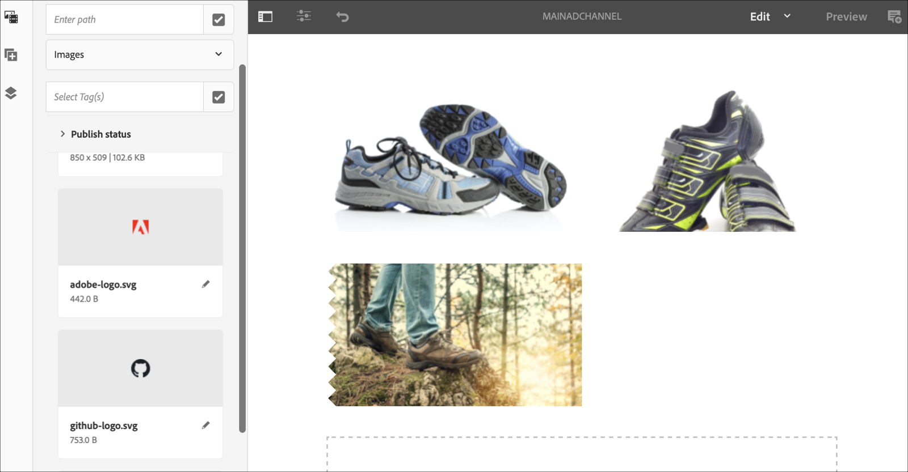
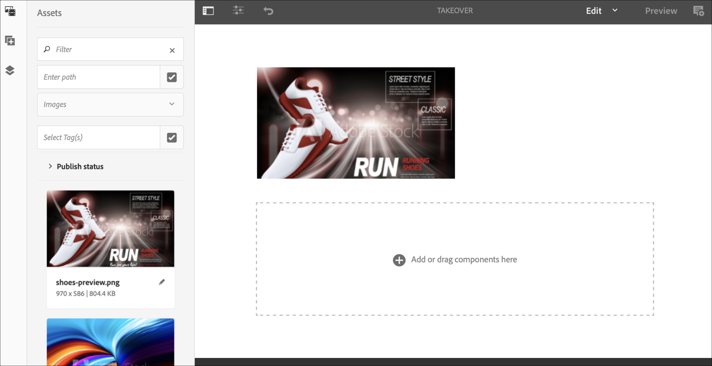

# Canale di acquisizione perpetua {#perpetual-takeover-channel}

Nella pagina seguente viene illustrato un esempio di utilizzo che mette in evidenza la configurazione di un progetto per la creazione di un canale di acquisizione perpetua che viene riprodotto per un giorno e un&#39;ora specifici in modo continuo.

## Descrizione di un caso d’uso {#use-case-description}

Questo caso d’uso spiega come creare un canale che *prende il sopravvento* dal canale normalmente utilizzato per un display o un gruppo di schermi. L&#39;acquisizione avverrà per un giorno e un&#39;ora specifici in perpetuo.
Ad esempio, esiste un canale Perpetual TakeOver che viene riprodotto ogni venerdì dalle 9 alle 10. Durante questo periodo, nessun altro canale dovrebbe essere riprodotto. L&#39;esempio seguente mostra la creazione di un canale di acquisizione perpetuo che consente la riproduzione dei contenuti ogni mercoledì per 2 ore dalle 14:00 alle 16:00.

### Premesse {#preconditions}

Prima di iniziare questo caso di utilizzo, accertatevi di comprendere come:

* **[Creare e gestire canali](managing-channels.md)**
* **[Creare e gestire le posizioni](managing-locations.md)**
* **[Creare e gestire le pianificazioni](managing-schedules.md)**
* **[Registrazione dispositivo](device-registration.md)**

### Attori primari {#primary-actors}

Autori contenuto

## Impostazione del progetto {#setting-up-the-project}

Per impostare un progetto, effettuate le seguenti operazioni:

**Impostazione dei canali e della visualizzazione**

1. Crea un progetto AEM Screens denominato **PerpetualTakeOver**, come illustrato di seguito.

   

1. Create un **MainAdChannel** nella cartella **Channels** .

   

1. Selezionate **MainAdChannel** e fate clic su **Modifica** nella barra delle azioni. Trascinate alcune risorse (immagini, video, sequenze incorporate) sul canale.

   

   >[!NOTE]
   >In questo esempio, **MainAdChannel** mostra un canale di sequenza che riproduce continuamente il contenuto.

1. Create un canale **TakeOver** che occupi il contenuto in **MainAdChannel** e che verrà riprodotto ogni mercoledì dalle 2:00 alle 4:00.

1. Selezionate **TakeOver** e fate clic su **Modifica** nella barra delle azioni. Trascinate alcune risorse sul canale. L’esempio seguente mostra un’immagine a zona singola aggiunta al canale.

   

1. Configurate una posizione e una visualizzazione per i canali. Ad esempio, la seguente posizione **MainLobby** e visualizzazione **MainLobbyDisplay** è impostata per questo progetto.

   

**Assegnazione di canali a una visualizzazione**

1. Selezionate la visualizzazione **MainLobbyDisplay** dalla cartella **Locations** . Fate clic su **Assegna canale** dalla barra delle azioni per aprire la finestra di dialogo Assegnazione **** canale.

   >[!NOTE]
   >Per informazioni su come assegnare un canale a uno schermo, fare riferimento a Assegnazione ****canale.

1. Compilare i campi (Percorso **** canale, **Priorità** ed Eventi **** supportati) dalla finestra di dialogo Assegnazione **** canale e fare clic su **Salva** **** per assegnare il canale principaleal display.

   * **Percorso** canale: Selezionare il percorso del canale **MainAdChannel**
   * **Priorità**: Imposta la priorità del canale su 1.
   * **Eventi** supportati: Selezionate la schermata **iniziale Carica** e **Inattivo**.
   

1. Selezionate la visualizzazione **TakeOver** dalla cartella **Locations** . Fate clic su **Assegna canale** dalla barra delle azioni per assegnare il canale di acquisizione.

1. Per assegnare il canale **TakeOver** al display in un momento programmato e compilare i campi seguenti dalla finestra di dialogo Assegnazione **** canale, quindi fare clic su **Salva**:

   * **Percorso** canale: Selezionare il percorso del canale **TakeOver**
   * **Priorità**: Impostare la priorità di questo canale maggiore di **MainAdChannel**. Ad esempio, la priorità impostata in questo esempio è 8.
   * **Eventi** supportati: Selezionate **Schermo** inattivo e **Timer**.
   * **Pianificazione**: Immettere il testo per la pianificazione che si desidera che il canale esegua la visualizzazione. Il testo nel **Programma** di cui all&#39;esempio è riportato *il mercoledì dopo le 14:00 e prima delle 16:00*.
      [!NOTE]
      > Per ulteriori informazioni sulle espressioni che è possibile aggiungere alla **programmazione**, fare riferimento alla sezione Espressioni [di](#example-expressions) esempio di seguito
   * **attiva da**: Data e ora di inizio.
   * **attivo fino** a: Data e ora di fine.
   Ad esempio, il testo in **Pianificazione** e **attivo da** data e ora **** attiva qui consente la riproduzione del contenuto ogni mercoledì dalle 2:00 alle 16:00.

   

   Andate alla visualizzazione da **TakeOver** —> **Locations** —> **MainLobby** —> **MainLobbyDisplay** e fate clic su **Dashboard** dalla barra delle azioni per visualizzare i canali assegnati con le relative priorità, come mostrato di seguito.

   >[!NOTE]
   >È obbligatorio impostare la priorità del canale di acquisizione come massima.

   Ora, il canale **TakeOver** acquisirà il **MainAdChannel** alle 14:00 per due ore fino alle 16:00 ogni mercoledì e riprodurrà i contenuti dal 09 gennaio 2020 al 31 gennaio 2020.

### Espressioni di esempio {#example-expressions}

Nella tabella seguente sono riepilogate alcune espressioni di esempio che è possibile aggiungere alla pianificazione durante l&#39;assegnazione di un canale a una visualizzazione.

| **Espressione** | **Interpretazione** |
|---|---|
| prima delle 8:00 | il canale gioca prima delle 8:00 di ogni giorno |
| dopo le 14:00 | il canale gioca dopo le 2:00 pm ogni giorno |
| dopo le 12:15 e prima delle 12:45 | il canale riproduce dopo le 12:15 ogni giorno per 30 minuti |
| prima delle 12:15 anche dopo le 12:45 | il canale gioca prima delle 12:15 pm ogni giorno e poi anche dopo 12:45 pm |
| il 1° gennaio dopo le 14:00 anche il 2° giorno di gennaio anche il 3 gennaio prima delle 3:00 | il canale inizia a giocare dopo le 12:45 del 1° gennaio, continua a giocare per tutta la giornata il 2 gennaio fino alle 3:00 del 3 gennaio |
| il 1-2 giorno di gennaio dopo le 2:00 pm anche il 2-3 giorno di gennaio prima delle 3:00 | il canale avvia il lettore dopo le 12:45 del 1° gennaio, continua a giocare fino alle 3:00 del 2 gennaio, poi riparte il 2 gennaio alle 12:45 del pomeriggio e continua a giocare fino alle 3:00 del 3 gennaio |

È inoltre possibile utilizzare la notazione _militare dell&#39;ora_ (cioè 14:00) invece della notazione AM/pm (cioè 2:00 pm)
