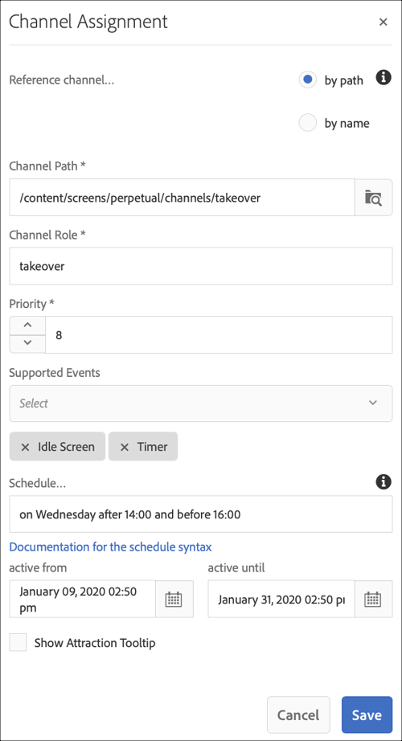

# Canale TakeOver permanente {#perpetual-takeover-channel}

>[!IMPORTANT]
>Questo contenuto è valido per AEM on-premise/AMS (AEM 6.5LTS e AEM 6.5). Per i contenuti di AEM as a Cloud Service Screens, consulta la [guida di AEM as a Cloud Service](https://experienceleague.adobe.com/it/docs/experience-manager-cloud-service/content/screens-as-cloud-service/overview/introduction).

La pagina seguente presenta un caso d’uso con particolare attenzione alla configurazione di un progetto e spiega come creare un canale di acquisizione permanente che viene riprodotto continuamente per un giorno e un’ora specifici.

## Descrizione del caso d’uso {#use-case-description}

In questo caso d&#39;uso viene illustrato come creare un canale che *rileva* dal normale canale di riproduzione per una visualizzazione o un gruppo di visualizzazioni. L&#39;acquisizione avviene perennemente per un giorno e un&#39;ora specifici.Ad esempio, esiste un canale di acquisizione permanente che viene riprodotto ogni venerdì dalle 9 alle 10:00. Durante questo periodo, nessun altro canale dovrebbe essere riprodotto. :00:00L’esempio seguente illustra la creazione di un canale di acquisizione permanente che consente la riproduzione del contenuto ogni mercoledì per due ore, dalle 14:00 alle 16:00.:00:00

### Precondizioni {#preconditions}

Prima di iniziare questo caso d’uso, assicurati di aver compreso come:

* **[Crea e gestisci canali](managing-channels.md)**
* **[Crea e gestisci posizioni](managing-locations.md)**
* **[Crea e gestisci pianificazioni](managing-schedules.md)**
* **[Registrazione dispositivo](device-registration.md)**

### Attori principali {#primary-actors}

Autori di contenuti

## Configurazione del progetto {#setting-up-the-project}

Per impostare un progetto, segui i passaggi seguenti:

**Configurazione di canali e visualizzazione**

1. Crea un progetto AEM Screens con titolo **PerpetualTakeOver**, come illustrato di seguito.

   

1. Crea un **MainAdChannel** nella cartella **Channels**.

   

1. Fai clic su **MainAdChannel** e fai clic su **Modifica** nella barra delle azioni. Trascina alcune risorse (immagini, video, sequenze incorporate) sul canale.

   

   >[!NOTE]
   >**MainAdChannel** in questo esempio illustra un canale di sequenza che riproduce il contenuto in modo continuo.

1. Crea un canale **TakeOver** che assume il contenuto in **MainAdChannel** e viene riprodotto ogni mercoledì dalle 14 alle 16:05.:00:00

1. Fai clic su **TakeOver** e fai clic su **Modifica** nella barra delle azioni. Trascina alcune risorse nel canale. L’esempio seguente mostra un’immagine di una singola zona aggiunta a questo canale.

   

1. Imposta una posizione e una visualizzazione per i canali. Ad esempio, per questo progetto sono impostati il percorso **MainLobby** e la visualizzazione **MainLobbyDisplay**.

   

**Assegnazione di canali a una visualizzazione**

1. Fare clic sulla visualizzazione **MainLobbyDisplay** dalla cartella **Locations**. Fare clic su **Assegna canale** nella barra delle azioni per aprire la finestra di dialogo **Assegnazione canale**.

   >[!NOTE]
   >Per informazioni su come assegnare un canale a una visualizzazione, consulta **[Assegnazione canale](channel-assignment.md)**.

1. Compila i campi (**Percorso canale**, **Priorità** e **Eventi supportati**) dalla finestra di dialogo **Assegnazione canale** e fai clic su **Salva** per assegnare **MainAdChannel** alla tua visualizzazione.

   * **Percorso canale**: fai clic sul percorso del canale **MainAdChannel**
   * **Priorità**: imposta la priorità del canale come 1.
   * **Eventi supportati**: fare clic su **Caricamento iniziale** e **Schermata di inattività**.

   

1. Fai clic sulla cartella **Percorsi** per visualizzare **Acquisisci**. Fai clic su **Assegna canale** dalla barra delle azioni per assegnare il canale di acquisizione.

1. Assegnazione del canale **TakeOver** alla visualizzazione in un orario pianificato. Quindi, compila i campi seguenti dalla finestra di dialogo **Assegnazione canale** e seleziona **Salva**:

   * **Percorso canale**: fai clic sul percorso del canale **TakeOver**
   * **Priorità**: imposta la priorità di questo canale maggiore di **MainAdChannel**. Ad esempio, la priorità impostata in questo esempio è 8.
   * **Eventi supportati**: fare clic sulla **schermata di inattività** e **Timer**.
   * **Pianificazione**: immettere il testo per la pianificazione che si desidera venga eseguita sul display da questo canale. Il testo nella **Pianificazione** menzionata in questo esempio è *mercoledì dopo le ore 14:00 e prima delle ore 16:00*.

     >[!NOTE]
     >Per ulteriori informazioni sulle espressioni che puoi aggiungere alla **Pianificazione**, consulta la sezione [Espressioni di esempio](#example-expressions) di seguito.
   * **attivo da**: data e ora di inizio.
   * **attivo fino a**: data e ora di fine.

     Ad esempio, il testo in **Pianificazione** e **Attivo da** e **Attivo fino a** data e ora qui consentono la riproduzione del contenuto ogni mercoledì dalle 14:6 alle 16:7&rbrace;.:00:00

     

     Passa alla visualizzazione da **TakeOver** > **Posizioni** > **MainLobby** > **MainLobbyDisplay**, quindi fai clic su **Dashboard** nella barra delle azioni per visualizzare i canali assegnati con le loro priorità, come illustrato di seguito.

     >[!NOTE]
     >È obbligatorio impostare come massima la priorità del canale di acquisizione.

     
Ora, il canale **TakeOver** rileva il canale **MainAdChannel** alle 2:00 P.M. per due ore fino alle 16:00 ogni mercoledì e riproduce il suo contenuto dal 9 gennaio 2020 al 31 gennaio 2020.

## Espressioni di esempio {#example-expressions}

Nella tabella seguente sono riepilogate alcune espressioni di esempio che è possibile aggiungere alla pianificazione durante l’assegnazione di un canale a una visualizzazione.

| **Espressione** | **Interpretazione** |
|---|---|
| prima delle 08:00:00 | il canale viene riprodotto prima delle 8:00 di ogni giorno |
| dopo le 14:00:00 | il canale viene riprodotto dopo le 14:00 di ogni giorno:00 |
| dopo 12:15 e prima di 12:45 | il canale viene riprodotto ogni giorno dopo le 12:15 per 30 minuti |
| prima del 12:15 anche dopo il 12:45 | il canale viene riprodotto ogni giorno prima delle 12:15 e poi anche dopo le 12:45. |
| il primo giorno di gennaio dopo le ore 2:00, anche il secondo giorno di gennaio e anche il terzo giorno di gennaio prima delle ore 3:00. | il canale inizia la riproduzione dopo le 2:00 P.M. del 01 gennaio, continua per l&#39;intero giorno del 02 gennaio fino alle 3:00 A.M. del 03 gennaio |
| nei 1-2 giorni di gennaio dopo le 2:00 P.M. anche nei 2-3 giorni di gennaio prima delle 3:00 a.m. | il canale avvia il lettore dopo le 2:00 P.M. del 01 gennaio, continua a giocare fino alle 3:00 A.M. del 02 gennaio, poi ricomincia il 02 gennaio alle 2:00 P.M. e continua a giocare fino alle 3:00 A.M. del 03 gennaio |

>[!NOTE]
>
>È inoltre possibile utilizzare la notazione _ora militare_ (14:00) invece di *A.M./P.M.* (2:00 P.M.).

