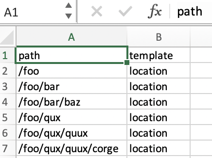

# Importazione di nuovi progetti da file {#new-project-importer-from-file}

Questa sezione descrive una funzionalità per importare in massa un set di posizioni da un foglio di calcolo CSV/XLS al progetto AEM Screens.

## Introduzione {#introduction}

Quando si configura un progetto AEM Screens, per la prima volta nell’organizzazione è necessario creare anche tutte le posizioni. Se il progetto coinvolge un numero elevato di posizioni, si ottiene un’attività noiosa che comporta molti clic e tempi di attesa nell’interfaccia utente.

L&#39;obiettivo di questa funzione è ridurre il tempo necessario per impostare il progetto e quindi risolvere i problemi di budget.

Lasciando che l’autore fornisca un foglio di calcolo come file di input e lasciando che il sistema crei automaticamente la struttura della posizione nel back-end, questa funzione:

* *offre prestazioni decisamente migliori rispetto ai clic manuali nell’interfaccia utente*
* *consente ai clienti di esportare le posizioni del proprio sistema e importarle direttamente in AEM*

Questo consente di risparmiare tempo e denaro durante la configurazione iniziale del progetto o quando si estende l’AEM Screens esistente a nuove posizioni.

## Panoramica dell&#39;architettura {#architectural-overview}

Il diagramma seguente illustra la panoramica architettonica della funzione Importazione progetti:

### Modello Dati {#data-model}

Il modello dati per Importazione progetti è descritto di seguito:

>[!NOTE]
>
>La versione corrente supporta solo le posizioni di importazione.

| **Proprietà** | **Descrizione** |
|---|---|
| ***percorso {string*}** | Percorso della risorsa per la posizione |
| ***[./jcr:title] {string*}** | Nome del modello da utilizzare (ovvero posizione per *screens/core/templates/location*) |
| ***modello {string}*** | Titolo facoltativo da utilizzare per la pagina |
| ***[./jcr:description] {string}*** | Descrizione facoltativa da utilizzare per la pagina |

Il file del foglio di calcolo (CSV/XLS) richiede quindi le colonne seguenti:

* **percorso {string}** Il percorso della posizione da importare, in cui la directory principale del percorso è la cartella della posizione del progetto (ovvero,  */* fooosarà importato in  */content/screens/&lt;project>/location/foo*)

* **modello {string}** Il modello da utilizzare per la nuova posizione, per ora l&#39;unico valore consentito è &quot;location&quot;, ma verrà esteso a tutti i modelli Screens in futuro (&quot;display&quot;, &quot;sequencechannel e così via)
* **[./*] {string}** Qualsiasi proprietà opzionale da impostare nel percorso (ovvero, ./jcr:title, ./jcr:description, ./foo, ./barra). Al momento la versione corrente non consente alcun filtraggio

>[!NOTE]
>
>Qualsiasi colonna che non corrisponde alle condizioni precedenti verrà semplicemente ignorata. Ad esempio, se nel file del foglio (CSV/XLS) sono definite altre colonne diverse da **path**,**template**,**title** e **description** nel file, tali campi verranno ignorati e **Importazione progetti** non convalidi tali campi aggiuntivi importare il progetto nel progetto AEM Screens.

## Utilizzo di Importazione progetti {#using-project-importer}

La sezione seguente descrive come viene utilizzato Importazione progetti in un progetto AEM Screens.

>[!CAUTION]
>
>Limiti:
>
>* I file diversi dalle estensioni CSV/XLS/XLSX non sono supportati nella versione corrente.
>* Per i file importati non esiste alcun filtro delle proprietà e tutto ciò che inizia con &quot;./&quot; verrà importato.

>

### Prerequisiti {#prerequisites}

* Crea un nuovo progetto denominato **DemoProjectImport**

* Utilizza un file CSV o excel di esempio da importare.

A scopo dimostrativo, è possibile scaricare un file excel dalla sezione seguente.

[Ottieni file](assets/minimal-file.xls)

### Importazione del file con campi obbligatori minimi {#importing-the-file-with-minimum-required-fields}

Per importare un file in una cartella di posizioni con campi obbligatori minimi, effettua le seguenti operazioni:

>[!NOTE]
>
>L’esempio seguente illustra i quattro campi minimi necessari per importare il progetto:

1. Passa al progetto AEM Screens (**DemoProjectImport**).

   

1. Seleziona il progetto,** DemoProjectImporter **—>** Crea **—>** Importa posizioni** dalla barra laterale.

   

1. Viene aperta la procedura guidata **Importa**. Seleziona il file di cui disponi per il progetto con le posizioni oppure seleziona il file (***minimal-file.xls***) scaricato dalla sezione *Prerequisites* .

   Dopo aver selezionato il file, fai clic su **Avanti**.

   

1. Verifica il contenuto del file (posizioni) dalla procedura guidata di importazione e fai clic su **Importa**.

   

1. Di conseguenza, ora potrai visualizzare tutte le posizioni importate nel progetto.

   
