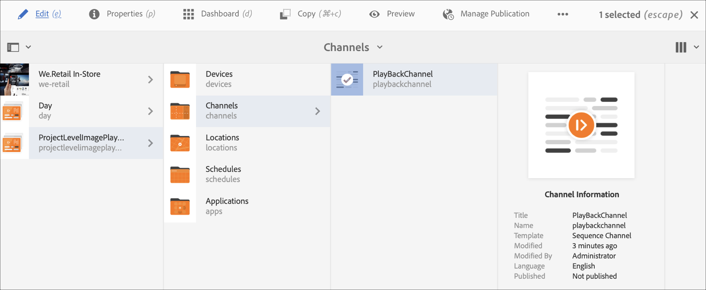

# Durata riproduzione immagine a livello di progetto {#project-level-image-playback}

## Panoramica {#overview}

Questa funzione consente di definire la durata di riproduzione dell’immagine a livello di progetto. Per impostazione predefinita, tutte le immagini ereditano questa durata di riproduzione. Se a livello di progetto non è definita alcuna durata, la riproduzione predefinita di 8 secondi continua.

### Prerequisiti {#prerequisites}

Prima di utilizzare questa funzione, imposta un progetto come prerequisito per iniziare a implementarla. Ad esempio:

1. Crea un progetto AEM Screens (in questo esempio, **RiproduzioneLivelloProgetto**).
1. Crea un canale di sequenza come **PlayBackChannel** nella cartella **Channels**.
1. Aggiungi contenuto a **PlayBackChannel**.

   

   Ad esempio, nell&#39;immagine seguente sono illustrate le immagini aggiunte all&#39;editor **PlayBackChannel**:

   

## Modifica dell&#39;assegnazione della durata di riproduzione immagine a livello di progetto {#editing-project-level-image-playback-duration-assignment}

La sezione seguente spiega come modificare la durata di riproduzione del contenuto in un progetto AEM Screens.

### Aggiornamento della durata di riproduzione per le immagini a livello di progetto {#updating-the-playback-duration-for-images-in-a-project}

>[!NOTE]
>
>Se desideri aggiornare la durata di riproduzione di un&#39;immagine o a livello di canale, consulta [Durata di riproduzione immagine a livello di canale](channel-level-image-playback.md).

Per informazioni su come aggiornare la durata di riproduzione delle immagini a livello di progetto, effettua le seguenti operazioni:

1. Passa al progetto **RiproduzioneLivelloProgetto** e fai clic su **Proprietà** nella barra delle azioni.
   

1. Fare clic su tutte le immagini del canale e fare clic sull&#39;icona chiave inglese in alto a sinistra (come illustrato nella figura riportata di seguito) per aprire la finestra di dialogo Configurazione a livello di canale.

   

1. Viene visualizzata la finestra di dialogo **Pagina**.

   >[!NOTE]
   >
   >Per impostazione predefinita, le immagini in un canale sono impostate su una durata di riproduzione di 8 secondi e i video vengono riprodotti alla durata predefinita.

   

   Modifica la **Durata** da 8000 (millisecondi) a 3000 (millisecondi), ovvero 3 secondi. Seleziona il segno di spunta in alto a destra nella finestra di dialogo **Pagina** per salvare le modifiche.

   

### Visualizzazione del risultato {#viewing-the-result}

Dopo aver aggiornato la durata di riproduzione del canale (in questo esempio, tutte e tre le immagini), le immagini vengono ora riprodotte per 3 secondi anziché 8 secondi (valore predefinito).

