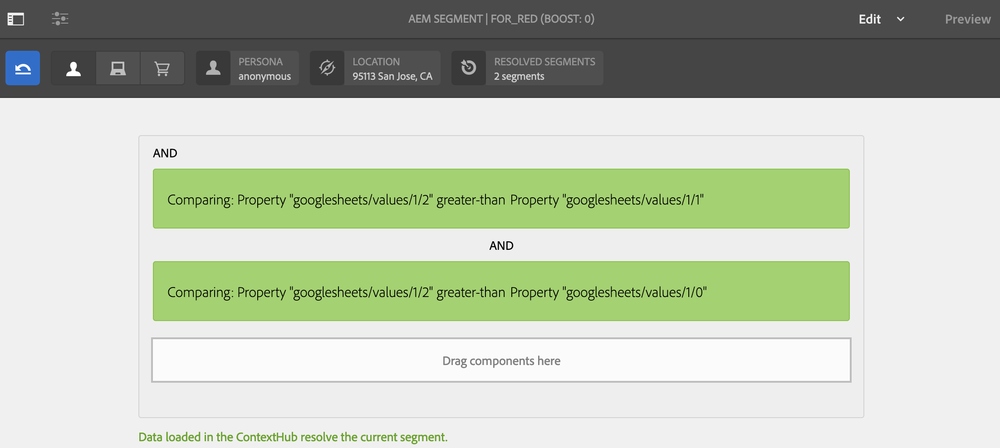
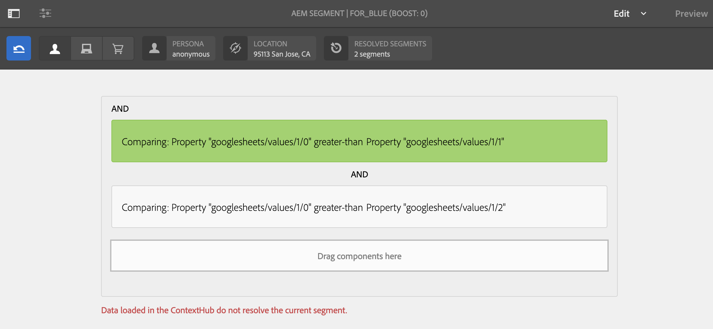
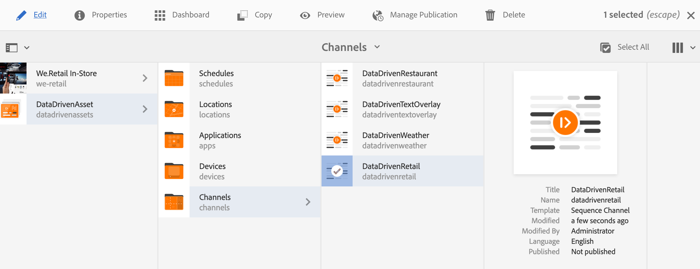
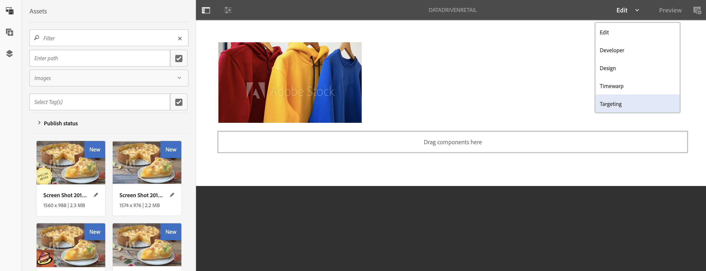

# Attivazione con targeting magazzino vendita al dettaglio {#retail-inventory-targeted-activation}

>[!IMPORTANT]
>Questo contenuto è valido per AEM on-premise/AMS (AEM 6.5LTS e AEM 6.5). Per i contenuti di AEM as a Cloud Service Screens, consulta la [guida di AEM as a Cloud Service](https://experienceleague.adobe.com/it/docs/experience-manager-cloud-service/content/screens-as-cloud-service/overview/introduction).

Il seguente caso d’uso illustra tre diverse immagini in base ai valori presenti nel foglio Google.

## Descrizione {#description}

Questo caso d’uso presenta le scorte di magazzino al dettaglio per tre felpe colorate diverse. A seconda del numero di felpe disponibili che vengono registrate in Google Sheets, viene visualizzata l’immagine (felpa rossa, verde o blu) con il numero più alto.

Il maglione rosso, verde o blu viene visualizzato in base al valore più alto del numero di maglie disponibili.

## Precondizioni {#preconditions}

Prima di iniziare a implementare l&#39;attivazione del targeting dell&#39;inventario di vendita al dettaglio, scopri come impostare ***Archivio dati***, ***Segmentazione pubblico*** e ***Abilita targeting per canali*** in un progetto AEM Screens.

Per informazioni dettagliate, vedere [Configurazione di ContextHub in AEM Screens](configuring-context-hub.md).

## Flusso di base {#basic-flow}

Per implementare il caso d’uso di Retail Inventory Activation, effettua le seguenti operazioni:

1. **Compilazione dei fogli di Google**

   1. Passa al foglio Google ContextHubDemo.
   1. Aggiungi tre colonne (rosso, verde e blu) con i valori corrispondenti per tre diverse felpe.

   

1. **Configurazione del pubblico in base ai requisiti**

   1. Passa ai segmenti del pubblico (consulta ***Passaggio 2: impostazione della segmentazione del pubblico*** in **[configurazione di ContextHub nella pagina AEM Screens](configuring-context-hub.md)** per ulteriori dettagli).

   1. Aggiungi tre nuovi segmenti **For_Red**, **For_Green** e **For_Blue**.

   1. Fai clic su **For_Red** e fai clic su **Modifica** nella barra delle azioni.

   1. Trascinare e rilasciare **Comparison : Property - Property** nell&#39;editor.
   1. Fai clic sull&#39;icona **Configurazione**.
   1. Fare clic su **googlesheets/value/1/2** dall&#39;elenco a discesa in **First Property name**.
   1. Fai clic su **Operatore** e come **maggiore di** dal menu a discesa.
   1. Fai clic su **Tipo di dati** e come **numero**.
   1. Fare clic su **googlesheets/value/1/1** dall&#39;elenco a discesa in **Second Property name**.
   1. Trascina **un altro confronto: Property - Property** nell&#39;editor e fai clic sull&#39;icona **Configuration**.
   1. Fare clic su **googlesheets/value/1/2** dall&#39;elenco a discesa in **First Property name**.
   1. Fai clic su **Operatore** e come **maggiore di** dal menu a discesa.
   1. Fai clic su **Tipo di dati** e come **numero**.
   1. Fare clic su **googlesheets/value/1/0** dall&#39;elenco a discesa in **Second Property name**.

   

   Allo stesso modo, modifica e aggiungi regole di proprietà di confronto al segmento **For_Blue** come mostrato nella figura seguente:

   

   Allo stesso modo, modifica e aggiungi regole di proprietà di confronto al segmento **For_Green** come mostrato nella figura seguente:

   

   >[!NOTE]
   >
   >Tieni presente che per i segmenti **For_Green** e **For_Green**, i dati non possono essere risolti nell&#39;editor in quanto solo il primo confronto è ora valido in base ai valori nel foglio di Google.

1. Naviga e fai clic sul tuo canale **DataDrivenRetail** (un canale di sequenza).
1. Fai clic su **Modifica** nella barra delle azioni.

   

   >[!CAUTION]
   >
   >Dovresti aver già configurato le **Configurazioni** ContextHub **&#x200B;**&#x200B;utilizzando la scheda **Proprietà** > **Personalization** del canale.

   

   >[!NOTE]
   >
   >Fare clic su **Marchio** e **Area** per elencare correttamente le attività all&#39;avvio del processo di targeting.

1. **Aggiunta immagine predefinita**

   1. Aggiungi un&#39;immagine predefinita al tuo canale e fai clic su **Targeting**.
   1. Fai clic su **Marchio** e **Attività** dal menu a discesa, quindi fai clic su **Inizia impostazione destinazione**.
   1. Fare clic su **Inizia impostazione destinazione**.

   

   >[!NOTE]
   >
   >Prima di iniziare il targeting, aggiungi i segmenti (**For_Green**, **For_Red** e **For_Blue**) selezionando **+ Aggiungi targeting esperienza** dalla barra laterale, come illustrato nella figura seguente.

   

1. Aggiungi le immagini a tutti e tre i diversi scenari come mostrato di seguito.

   

1. **Controllo dell&#39;anteprima**

   1. Fare clic su **Anteprima.** Inoltre, aprire Google Sheet e aggiornarne il valore.
   1. Modifica il valore per tutte e tre le colonne. Osserva gli aggiornamenti dell’immagine di visualizzazione in base al valore più alto nell’inventario.

   
