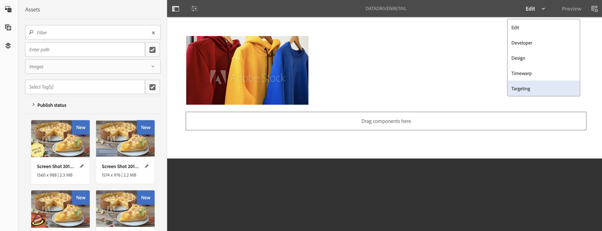

# Attivazione mirata inventario vendita al dettaglio {#retail-inventory-targeted-activation}

Il seguente esempio illustra tre diverse immagini basate sui valori di Google Sheet.

## Descrizione {#description}

Questo caso d&#39;uso mostra il magazzino al dettaglio per tre diverse maglie colorate. A seconda del numero di maglie disponibili in magazzino che viene registrato in Google Sheets, l&#39;immagine (rosso, verde, o blu felpa) con il numero più alto è visualizzata sullo schermo.

Per questo caso d&#39;uso, il maglione rosso, verde o blu verrà visualizzato sul vostro schermo in base al valore più alto del numero di maglie che è disponibile.

## Premesse {#preconditions}

Prima di iniziare ad implementare l&#39;attivazione del targeting delle scorte per la vendita al dettaglio, devi imparare a configurare ***Data Store***, segmentazione ****** dell&#39;audience e ***abilitare il targeting per i canali*** in un progetto AEM Screens.

Per informazioni dettagliate, consultate [Configurazione di ContextHub in AEM Screens](configuring-context-hub.md) .

## Flusso di base {#basic-flow}

Per implementare il caso di utilizzo Attivazione magazzino al dettaglio, effettuate le seguenti operazioni:

1. **Compilazione dei fogli di Google**

   1. Passare al foglio di Google ContextHubDemo.
   1. Aggiungete tre colonne (rosso, verde e blu) con i valori corrispondenti per tre diverse maglie.
   

1. **Configurazione dell&#39;audience in base ai requisiti**

   1. Andate ai segmenti del pubblico (fate riferimento al ***Passaggio 2: Impostazione della segmentazione*** dell&#39;audience nella pagina **[Configurazione di ContextHub in AEM Screens](configuring-context-hub.md)**per ulteriori dettagli).

   1. Aggiungete tre nuovi segmenti **For_Red**, **For_Green** e **For_Blue**.

   1. Selezionate **For_Red** e fate clic su **Modifica** nella barra delle azioni.

   1. Trascina e rilascia il **confronto: Proprietà - Proprietà** per l&#39;editor e fare clic sull&#39;icona di configurazione per modificare le proprietà.
   1. Selezionare **googlesheets/value/1/2** dall&#39;elenco a discesa in **Nome proprietà**

   1. Selezionate **Operatore** come **maggiore di** dal menu a discesa

   1. Seleziona tipo **di** dati come **numero**

   1. Selezionare **googlesheets/value/1/1** dall&#39;elenco a discesa in **Secondo nome** proprietà.

   1. Trascina e rilascia **un altro confronto: Proprietà - Proprietà** per l&#39;editor e fare clic sull&#39;icona di configurazione per modificare le proprietà.
   1. Selezionare **googlesheets/value/1/2** dall&#39;elenco a discesa in **Nome** proprietà.

   1. Selezionate **Operatore** come **maggiore di** dal menu a discesa

   1. Seleziona tipo **di** dati come **numero**

   1. Selezionare **googlesheets/value/1/0** dall&#39;elenco a discesa in **Secondo nome proprietà**
   

   Analogamente, modificate e aggiungete le regole delle proprietà di confronto al segmento **For_Blue** come illustrato nella figura seguente:

   

   Analogamente, modificate e aggiungete le regole di proprietà di confronto al segmento** For_Green **come illustrato nella figura seguente:

   

   >[!NOTE]
   >
   >Noterete che per i segmenti **For_Green** e **For_Green**, i dati non possono essere risolti nell&#39;editor in quanto solo il primo confronto è valido da ora come dai valori nel Google Sheet.

1. Individua e seleziona il canale **DataDrivenRetail** (un canale della sequenza), quindi fai clic su **Modifica** nella barra delle azioni.

   

   >[!CAUTION]
   >
   >Avreste dovuto configurare le vostre **configurazioniContextHub** **configurando** il canale **Proprietà** —> scheda **Personalizzazione** .

   

   >[!NOTE]
   È necessario selezionare sia il **marchio** che l&#39; **area** per elencare correttamente le attività all&#39;avvio del processo di targeting.

1. **Aggiunta di un’immagine predefinita**

   1. Aggiungete un&#39;immagine predefinita al canale e fate clic su **Targeting**.
   1. Selezionate **Marchio** e **Attività** dal menu a discesa e fate clic su **Avvia targeting**.

   1. Fai clic su **Inizia impostazione destinazione**.
   

   >[!NOTE]
   Prima di iniziare il targeting, è necessario aggiungere i segmenti (**For_Green**, **For_Red** e **For_Blue**) facendo clic su **+ Aggiungi targeting** esperienza dalla barra laterale, come illustrato nella figura riportata di seguito.

   

1. Aggiungete le immagini a tutti e tre gli scenari, come illustrato di seguito.

   

1. **Verifica dell’anteprima**

   1. Fate clic su **Anteprima.** Inoltre, aprite il foglio di Google e aggiornate il relativo valore.
   1. Modificate il valore per tutte e tre le colonne e noterete gli aggiornamenti delle immagini di visualizzazione in base al valore più alto nell&#39;inventario.
   

