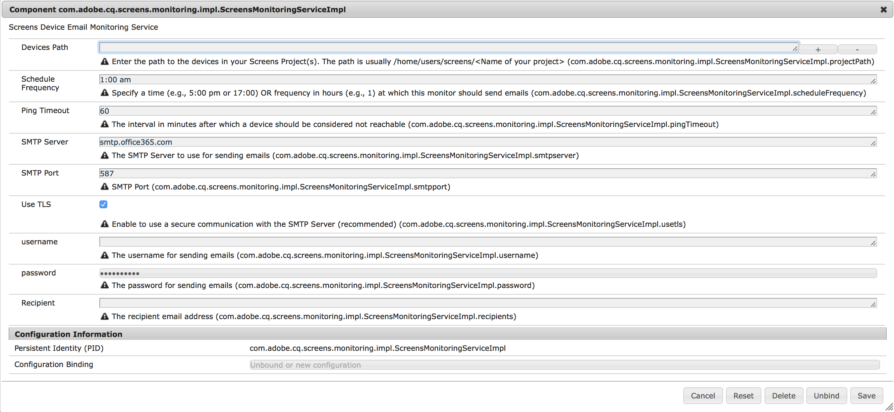

# Servizio notifiche AEM Screens{#aem-screens-notifications-service}

<!--removed from metadata: admitteddomains: @adobe.com;@caesars.com-->

***AEM Screens Notifications Service*** descrive la funzione che consente di monitorare l’attività del dispositivo.

Questa sezione tratta i seguenti argomenti:

* **Panoramica**
* **Configurazione delle impostazioni e-mail**
* **Notifica e-mail**
* **Caso d’uso di esempio**

>[!CAUTION]
>
>Questa funzionalità di AEM Screens è disponibile solo se hai installato AEM Feature Pack 3 o AEM 6.4.1 Screens Feature Pack 1 di 6.3.2.
>
>Per accedere a questo Feature Pack, è necessario contattare Adobe Support e richiedere l&#39;accesso. Una volta ottenute le autorizzazioni, è possibile scaricare il Feature Pack da Condivisione pacchetti.

## Panoramica {#overview}

***Servizio notifiche AEM Screens***, consente agli amministratori di ricevere un’e-mail se un lettore di schermi AEM non esegue il ping per un periodo di tempo configurabile.

Questo servizio può essere configurato nella console Web OSGi.

## Configurazione delle impostazioni e-mail {#configuring-email-settings}

Per configurare le impostazioni di notifica e-mail, effettua le seguenti operazioni:

1. Apri **Configurazione console Web Adobe Experience Manager**.
1. Apri **Screens Device Email Monitoring Service**.

   

1. Definisci i campi seguenti per configurare le impostazioni per l’e-mail:

   **Percorso** dispositiviImmettere il percorso dei progetti Screens che si desidera monitorare. In genere il percorso è `/home/users/screens/<Name of your project>`.

   Ad esempio, se il progetto è **We.Retail**, utilizzerai il percorso del progetto come ***/home/users/screens/we-retail***.

   >[!NOTE]
   >
   >Specifica il percorso del progetto, in cui si trovano gli utenti del dispositivo.

   **Pianificazione** FrequenzaSpecifica un&#39;ora (ad esempio, 5:00 o 17:00) o una frequenza in ore (ad esempio, 1) in cui il monitoraggio deve inviare le e-mail.

   **Ping** TimeoutSpecifica l&#39;intervallo in minuti dopo il quale un dispositivo deve essere considerato non raggiungibile.

   **SMTP** ServerSpecifica il server SMTP utilizzato per l&#39;invio delle e-mail.

   **Porta SMTP** Immettere la porta SMTP.

   **L&#39;utilizzo di TLS (** TLSTransport Layer Security) consente di utilizzare una comunicazione sicura con il server SMTP.

   Si consiglia di utilizzare TLS per una connessione sicura ai server di posta aziendale. Per i valori appropriati, rivolgiti al tuo amministratore della posta.

   **** usernameSpecifica il nome utente per l’invio delle e-mail.

   **** passwordSpecifica la password per l’invio di e-mail.

   **** RecipientSpecifica l’indirizzo e-mail del destinatario.

   >[!NOTE]
   >
   >Puoi immettere un solo indirizzo e-mail. Per inviare un’e-mail in blocco, crea un gruppo o una lista di distribuzione con gli utenti interessati.

1. Fai clic su **Salva** per configurare l&#39;attività di monitoraggio tramite un messaggio e-mail per il dispositivo AEM Screens.

## Notifica e-mail {#email-notification}

Una volta impostata la configurazione per le notifiche e-mail, riceverai una notifica e-mail che conterrà il collegamento al dispositivo effettivo segnalato di inattività.

L’accesso a tale collegamento ti porterà direttamente al dashboard del dispositivo.

Le e-mail verranno inviate solo se al momento della generazione dell’e-mail non è presente almeno un dispositivo con ping in ping per il timeout specificato e se il ping non esegue il ping.

### Esempi di casi d&#39;uso {#example-use-cases}

L&#39;esempio seguente descrive alcuni scenari di riferimento per configurare le proprietà da Screens Device Email Monitoring Service.

**Scenario 1**:

Se imposti la frequenza di pianificazione come 1:00 e il timeout di ping come 60, se il tuo dispositivo Screens non effettua il ping tra le 12:00 e le 13:00 riceverai una notifica e-mail di conferma dell’inattività del dispositivo.

**Scenario 2**:

Se imposti la frequenza di pianificazione su 1 e il timeout di ping su 60, se il tuo dispositivo Screens non effettua il ping tra una sola volta in un dato momento della giornata, riceverai una notifica e-mail di conferma dell’inattività del dispositivo.
