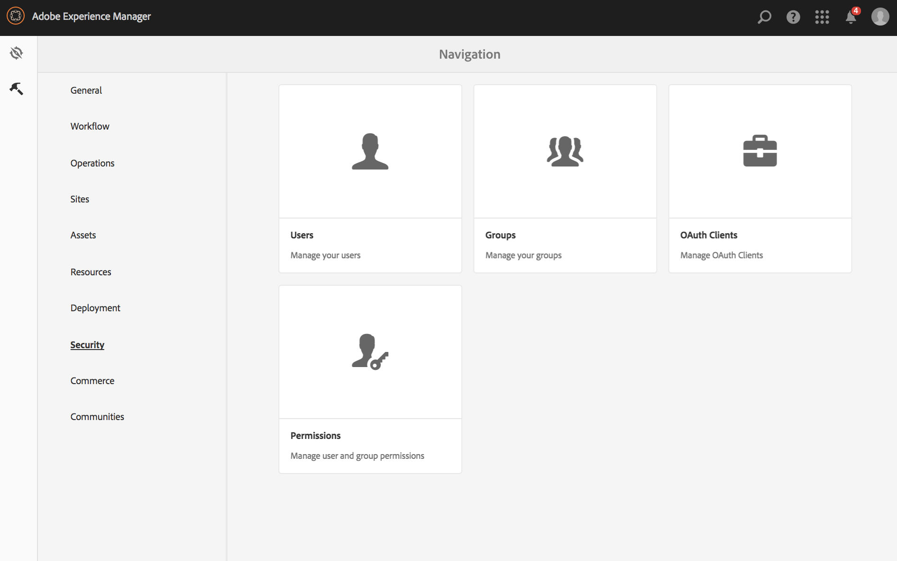
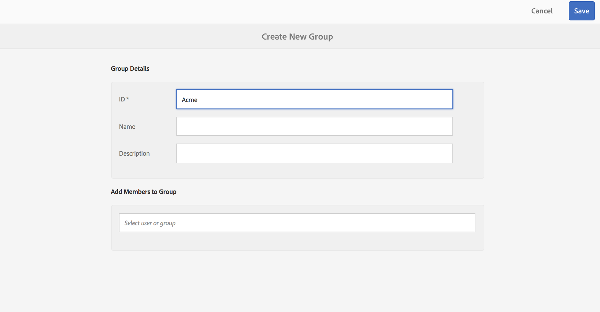
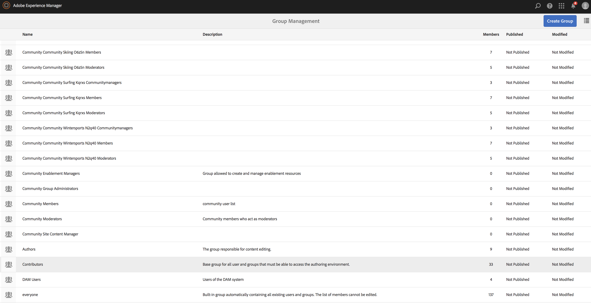
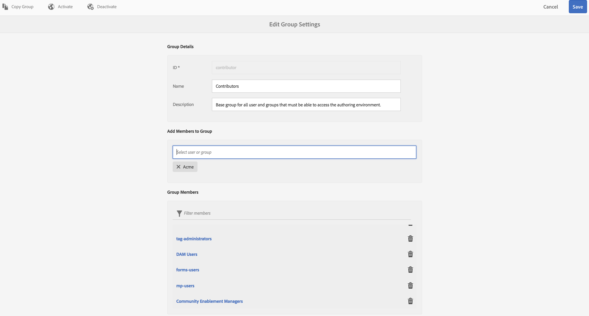
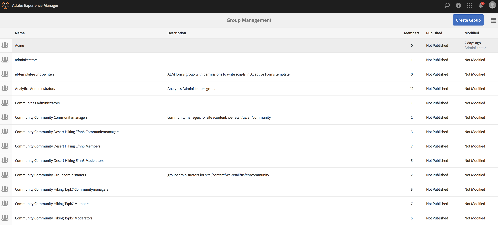
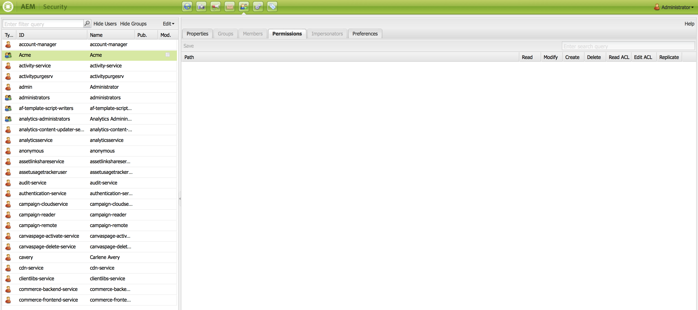

# Impostazione degli elenchi di controllo di accesso (ACL) {#setting-up-acls}

>[!IMPORTANT]
>Questo contenuto è valido per AEM on-premise/AMS (AEM 6.5LTS e AEM 6.5). Per i contenuti di AEM as a Cloud Service Screens, consulta la [guida di AEM as a Cloud Service](https://experienceleague.adobe.com/en/docs/experience-manager-cloud-service/content/screens-as-cloud-service/overview/introduction).

Nella sezione seguente viene illustrato come separare i progetti utilizzando gli elenchi di controllo di accesso (ACL, Access Control List) in modo che ogni singolo utente o team gestisca il proprio progetto.

In qualità di amministratore di AEM, desideri garantire che i membri del team di un progetto non interferiscano con altri progetti. A ogni utente vengono assegnati ruoli specifici in base ai requisiti del progetto.

## Impostazione delle autorizzazioni {#setting-up-permissions}

I passaggi seguenti riepilogano la procedura per la configurazione di ACL per un progetto:

1. Accedi ad AEM e passa a **Strumenti** > **Sicurezza**.

   

1. Fai clic su **Gruppi** e immetti un ID (ad esempio, Acme).

   In alternativa, utilizzare questo collegamento, `http://localhost:4502/libs/granite/security/content/groupadmin.html`.

   Fare clic su **Salva**.

   

1. Fare clic su **Collaboratori** dall&#39;elenco e fare doppio clic su di esso.

   

1. Aggiungi **Acme** (progetto creato) a **Aggiungi membri al gruppo**. Fai clic su **Salva**.

   

   >[!NOTE]
   >
   >Se si desidera che i membri del team di progetto registrino i giocatori (il che comporta la creazione di un utente per ogni giocatore), individuare gli utenti-amministratori del gruppo e aggiungere il gruppo ACME agli utenti-amministratori

1. Aggiungi tutti gli utenti che lavorano al progetto **Acme** al gruppo **Acme**.

   

1. Configura le autorizzazioni per il gruppo **Acme** utilizzando `(http://localhost:4502/useradmin)`.

   Fai clic sul gruppo **Acme** e fai clic sulle **autorizzazioni**.

   

### Autorizzazioni {#permissions}

Nella tabella seguente viene riepilogato il percorso con le autorizzazioni a livello di progetto:

| **Percorso** | **Autorizzazione** | **Descrizione** |
|---|---|---|
| `/apps/<project>` | LEGGI | Fornire l’accesso ai file di progetto, se applicabile. |
| `/content/dam/<project>` | ALL | Fornisci l’accesso per archiviare le risorse del progetto, ad esempio immagini o video, in DAM. |
| `/content/screens/<project>` | ALL | Rimuove l’accesso a tutti gli altri progetti in /content/screens. |
| `/content/screens/svc` | LEGGI | Fornire accesso al servizio di registrazione. |
| `/libs/screens` | LEGGI | Fornire accesso a DCC. |
| `/var/contentsync/content/screens/` | ALL | Consente di aggiornare il contenuto offline del progetto. |

>[!NOTE]
>
>A volte è possibile separare le funzioni di authoring (come la gestione delle risorse e la creazione di canali) dalle funzioni di amministrazione (come la registrazione dei lettori). In questo scenario, crea due gruppi e aggiungi il gruppo dell’autore ai collaboratori e il gruppo dell’amministratore sia ai collaboratori che agli amministratori degli utenti.

### Creazione di gruppi {#creating-groups}

La creazione di un progetto dovrebbe anche creare gruppi di utenti predefiniti a cui è assegnato un set di autorizzazioni di base. Estendi le autorizzazioni ai ruoli tipici definiti in AEM Screens.

Ad esempio, puoi creare i seguenti gruppi specifici del progetto:

* Amministratori di progetto Screens
* Screens Project Operators (registrazione dei lettori e gestione di posizioni e dispositivi)
* Utenti di Screens Project (utilizzo di canali, pianificazioni e assegnazioni di canali)

Nella tabella seguente sono riepilogati i gruppi con descrizione e autorizzazioni per un progetto AEM Screens:

<table>
 <tbody>
  <tr>
   <td><strong>Nome gruppo</strong></td>
   <td><strong>Descrizione</strong></td>
   <td><strong>Autorizzazioni</strong></td>
  </tr>
  <tr>
   <td>Amministratori Screens  <em><code>screens-admins</code></em></td>
   <td>Accesso a livello di amministratore per le funzionalità di AEM Screens</td>
   <td>
    <ul>
     <li>Membro Di Collaboratori</li>
     <li>Membro di utenti-amministratori</li>
     <li>ALL /content/screens</li>
     <li>ALL /content/dam</li>
     <li>ALL /content/experience-fragments</li>
     <li>ALL/etc/design/screens</li>
    </ul> </td>
  </tr>
  <tr>
   <td>Utenti Screens  <em><code>screens-users</code></em></td>
   <td>Crea e aggiorna canali e pianificazioni e assegna a posizioni in AEM Screens</td>
   <td>
    <ul>
     <li>Membro Di Collaboratori</li>
     <li><code>&lt;project&gt; /content/screens</code></li>
     <li><code>&lt;project&gt; /content/dam</code></li>
     <li><code>&lt;project&gt; /content/experience-fragments</code></li>
    </ul> </td>
  </tr>
  <tr>
   <td>Operatori Screens  <em><code>screens-operators</code></em></td>
   <td>Creare e aggiornare la struttura della posizione e registrare i lettori in AEM Screens</td>
   <td>
    <ul>
     <li>Membro Di Collaboratori</li>
     <li><code>jcr:all /home/users/screens</code></li>
     <li><code>jcr:all /home/groups/screens</code></li>
     <li><code>&lt;project&gt; /content/screens</code></li>
    </ul> </td>
  </tr>
  <tr>
   <td>Lettori Screens  <em><code>screens-&lt;project&gt;-devices</code></em></td>
   <td>Tutti i lettori e tutti i lettori/dispositivi sono automaticamente membri dei collaboratori.</td>
   <td>
 Membro di collaboratori
 </td>
  </tr>
 </tbody>
</table>
