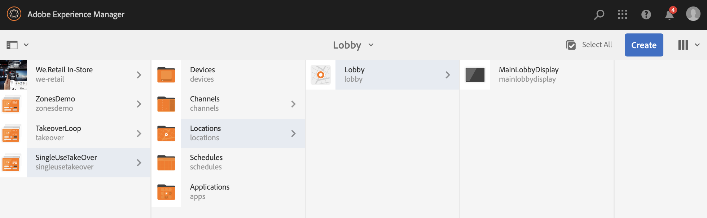

# Canale TakeOver per uso singolo {#single-use-takeover-channel}

Nella pagina seguente viene illustrato un esempio di utilizzo che mette in evidenza l’impostazione di un progetto per la creazione di un singolo canale TakeOver da riprodurre una sola volta per un’ora specifica.

## Descrizione di un caso d’uso {#use-case-description}

Questo caso d’uso spiega come creare un canale che *prende il sopravvento* dal canale normalmente utilizzato per un display o un gruppo di schermi. L&#39;acquisizione avverrà solo una volta e per un periodo di tempo determinato.
Ad esempio, esiste un canale TakeOver singolo che viene riprodotto il venerdì dalle 9 alle 10. Durante questo periodo, nessun altro canale dovrebbe essere riprodotto. Prima e dopo questo periodo, il canale di singola acquisizione non verrà riprodotto. L&#39;esempio seguente mostra la creazione di un singolo canale di acquisizione che consente la riproduzione dei contenuti per 2 minuti prima delle 12:00 del 31 dicembre fino alle 12:01.

### Premesse {#preconditions}

Prima di iniziare questo caso di utilizzo, accertatevi di comprendere come:

* **[Creare e gestire canali](managing-channels.md)**
* **[Creare e gestire le posizioni](managing-locations.md)**
* **[Creare e gestire le pianificazioni](managing-schedules.md)**
* **[Registrazione dispositivo](device-registration.md)**

### Attori primari {#primary-actors}

Autori contenuto

## Impostazione del progetto {#setting-up-the-project}

Per impostare un progetto, effettuate le seguenti operazioni:

**Impostazione dei canali e della visualizzazione**

1. Create un progetto AEM Screens denominato **SingleUseTakeOver**, come illustrato di seguito.

   

1. Create un **MainAdChannel** nella cartella **Channels** .

   

1. Selezionate **MainAdChannel** e fate clic su **Modifica** nella barra delle azioni. Trascinate alcune risorse (immagini, video, sequenze incorporate) sul canale.

   

   >[!NOTE]
   >In questo esempio, **MainAdChannel** mostra un canale di sequenza che riproduce continuamente il contenuto.

   

1. Create un canale **TakeOver** che occupi il contenuto in **MainAdChannel** e che verrà riprodotto solo per un giorno e un&#39;ora specifici.

1. Selezionate **TakeOver** e fate clic su **Modifica** nella barra delle azioni. Trascinate alcune risorse sul canale. L’esempio seguente mostra un’immagine a zona singola aggiunta al canale.

   

1. Configurate una posizione e una visualizzazione per i canali. Ad esempio, per questo progetto è impostata la seguente posizione **Sala d&#39;attesa** e visualizzazione **MainLobbyDisplay** .

   

**Assegnazione di canali a una visualizzazione**

1. Selezionate la visualizzazione **MainLobbyDisplay** dalla cartella **Locations** . Fate clic su **Assegna canale** dalla barra delle azioni.

   

   >[!NOTE]
   >Per informazioni su come assegnare un canale a uno schermo, fare riferimento a Assegnazione ****canale.

1. Compilate i campi (Percorso **** canale, **Priorità** ed Eventi **** supportati) dalla finestra di dialogo Assegnazione **** canale e fate clic su **Salva**. Ora hai assegnato **MainAdChannel** al tuo display.

   

1. Selezionate la visualizzazione **TakeOver** dalla cartella **Locations** . Fate clic su **Assegna canale** dalla barra delle azioni per assegnare il canale di acquisizione a uso singolo.

1. Per assegnare il canale **TakeOver** al display in un momento programmato e compilare i campi seguenti dalla finestra di dialogo Assegnazione **** canale, quindi fare clic su **Salva**:

   * **Percorso** canale: Selezionare il percorso del canale TakeOver
   * **Priorità**: Impostare la priorità di questo canale maggiore di **MainAdChannel**. Ad esempio, la priorità impostata in questo esempio è 8.
      >[!NOTE]
      >Priorità può essere qualsiasi valore superiore al valore di priorità del canale di riproduzione normale.
   * **Eventi** supportati: Selezionate **Schermo** inattivo e **Timer**.
   * **Pianificazione**: Immettere il testo per la pianificazione che si desidera che il canale esegua la visualizzazione. Ad esempio, il testo qui consente la riproduzione del contenuto 2 minuti prima delle 12:00 del 31 dicembre fino alle 12:01.
Il testo nella **Pianificazione** di cui al presente esempio è *il 31 dicembre dopo le 23:58 e anche il 1 gennaio prima delle 00.01*.

      

      Andate alla visualizzazione da **SingleUseTakeOver** —> **Locations** —> **Lobby** —> **MainLobbyDisplay** e fate clic su **Dashboard** dalla barra delle azioni per visualizzare i canali assegnati con le relative priorità, come mostrato di seguito.

      >[!NOTE]
      >È obbligatorio impostare la priorità del canale di acquisizione come massima.

      

>[!NOTE]
>È consigliabile eliminare il canale One Use TakeOver una volta riprodotto.