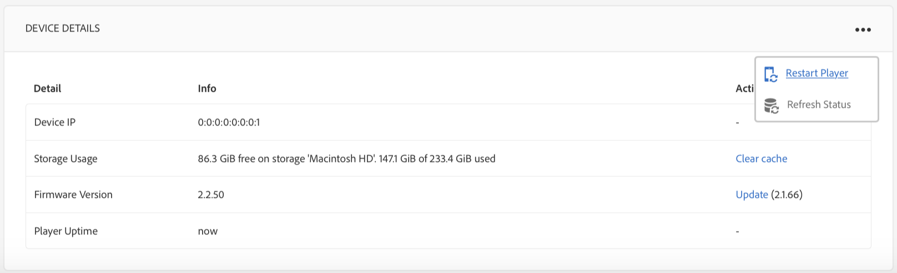
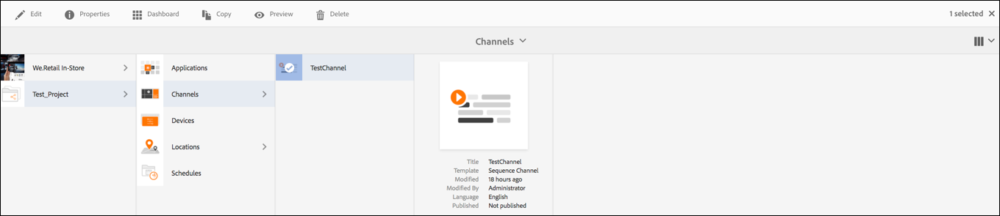

# Configurazione della riproduzione video e risoluzione dei problemi {#video-playback-configuration-and-troubleshooting}

Quando carichi un video in DAM e lo aggiungi al canale, potrebbero verificarsi dei problemi in cui il video potrebbe non essere riprodotto nel lettore AEM Screens.

Le sezioni seguenti descrivono come eseguire il debug e risolvere i problemi relativi alla riproduzione di video nel canale.

## Rappresentazioni DAM {#dam-renditions}

Una volta caricato il video sul canale, l’AEM dovrebbe iniziare a creare alcune rappresentazioni per esso. Puoi visualizzare i video in Risorse.

Per visualizzare il video:

1. Accedi al tuo video, ad esempio `http://localhost:4502/assets.html/content/dam/we-retail/en/videos`.
1. Fai clic sul video, espandi il menu in alto a sinistra e fai clic su **Rappresentazioni**.

Devono esistere diverse rappresentazioni (un MP4 o M4V).

Se non è presente alcuna rappresentazione, accertati di avere ffmpeg installato sul sistema operativo in cui è in esecuzione AEM.

>[!CAUTION]
>
>Se non è presente alcuna rappresentazione, accertati di avere ffmpeg installato sul sistema operativo in cui è in esecuzione AEM.
>
>Clic [qui](https://www.ffmpeg.org/download.html) per installare ffmpeg.

## Risorse video {#video-assets}

Se non trovi un attributo sorgente in video, è possibile che il video non sia stato transcodificato. Se il video è codificato correttamente, viene visualizzato nel dashboard, come illustrato di seguito:

Verificare che ffmpeg sia installato e che i profili video siano corretti.

### Verifica del profilo video {#checking-video-profile}

1. Accedi a **Profilo video**, ovvero `http://localhost:4502/etc/dam/video.html` e fai clic su **Carica video di prova**.

   

1. Carica un video di prova e fai clic su **Ok** così si può iniziare la transcodifica.

   Se il video transcodificato non riesce, espandi l’output ffmpeg per comprendere eventuali errori nell’output della console di ffmpeg.

   

   Inoltre, se il video transcodifica correttamente può scaricare il file transcodificato.

   

   >[!NOTE]
   >
   >Assicurati di dare al video il tempo sufficiente per la trascodifica (dovrebbe mostrare il nuovo tag invece dell’elaborazione) prima di aggiungerlo a qualsiasi canale.

### Verifica del profilo con un componente video {#checking-profile-with-a-video-component}

Se il componente video non è configurato correttamente, controlla l’elenco dei profili dalla progettazione della pagina.

1. Passa al tuo canale e seleziona la **Progettazione** modalità.

   

1. Seleziona il video e apri **Modifica** . Apri **Profili** scheda.

   >[!NOTE]
   >Seleziona profili diversi (dovrebbe esserci almeno il profilo &quot;H.264 di alta qualità&quot;).

### Controllo del video nel lettore web {#checking-the-video-in-the-web-player}

Utilizza il **Lettore Web** `http://localhost:4502/content/mobileapps/cq-screens-player/firmware.html/content/screens/we-retail/locations/demo/flagship/single/device0` per convalidare la riproduzione nei browser (Chrome e Safari). Chrome viene utilizzato sui dispositivi Android™ mentre Safari è il browser OS X e iOS.

Se il video non viene eseguito su Safari, non viene eseguito né sul sistema operativo X né sui lettori iOS. Questo è probabilmente un problema di codifica e il video deve essere codificato di nuovo.

Per utilizzare un flusso di lavoro DAM per creare rappresentazioni Full HD, effettuare le seguenti operazioni:

1. Accedi a *amministratore modello flusso di lavoro* che è `http://localhost:4502/libs/cq/workflow/admin/console/content/models.html/etc/workflow/models`.
1. Seleziona la **Risorsa per aggiornamento schermi** modello.
1. Seleziona **Avvia flusso di lavoro** dalla barra delle azioni.
1. Dalla sezione **Esegui flusso di lavoro** , seleziona la risorsa video in **Payload**.
1. Seleziona **Esegui**.

>[!NOTE]
>
>Attendi un po’ di tempo per creare le rappresentazioni, ma dopo alcuni secondi/minuti (a seconda della dimensione del video), ricarica il lettore web su Safari.

#### Risoluzione dei problemi relativi al flag di criteri Autoplay {#troubleshooting-autoplay-policy-flag}

Se il lettore AEM Screens riprende il video ma non lo visualizza, risolvi il problema con il flag di criteri Riproduzione automatica.

Per risolvere il problema del flag di criteri di riproduzione automatica di Google, segui la procedura seguente:

1. Accedi a ***chrome://flags/#autoplay-policy***
1. Cambia **Criterio Riproduzione automatica** da **Predefinito** a **non è richiesto alcun movimento utente**

1. Riavvia il browser web e aggiorna il lettore

>[!NOTE]
>
>Per ulteriori informazioni sulle best practice per una buona esperienza utente con i nuovi criteri di riproduzione automatica in Chrome, consulta la documentazione di *Modifiche ai criteri di Riproduzione automatica* a `https://developers.google.com/web/updates/2017/09/autoplay-policy-changes#webaudio`.

### Sincronizzazione di video tra più lettori {#syncing-video-across-multiple-players}

Per riprodurre i video in modo sincrono su più dispositivi, è necessario utilizzare la strategia assoluta per la sequenza di cui fa parte il video.

#### Requisiti {#requirements}

* più di 2 lettori identici
* hardware idealmente simile
* topologia di rete identica (i lettori sono collegati a un server NTP che allinea gli orologi di sistema interni)

#### Impostazione della strategia assoluta {#setting-up-the-absolute-strategy}

La strategia assoluta:

* Calcola un&#39;ora di ancoraggio (mezzanotte del giorno corrente).
* Calcola la durata della sequenza (somma della durata di tutti i relativi elementi).
* In qualsiasi momento, calcola l&#39;elemento da riprodurre e l&#39;elemento successivo risolvendo la sequenza _remaining_time = (current_time - anchor_time) % sequence_duration.

Per impostare una strategia assoluta, procedere come segue:

1. Passa all’autore del canale e seleziona il componente sequenza, come illustrato nella figura riportata di seguito.
1. Apri la relativa finestra di dialogo di configurazione.
1. Modifica il **Strategia** e aggiungi assoluto.

   

   >[!NOTE]
   >Il sistema operativo dei lettori deve avere lo stesso orologio.

**Allineamento degli orologi su OS X** Segui i passaggi seguenti per allineare gli orologi su OS X:

1. Apri **Data e ora** preferenze per ogni casella del sistema operativo X
1. Verifica **Imposta data e ora automaticamente**
1. Incolla il valore 0.pool.ntp.org, 1.pool.ntp.org, 2.pool.ntp.org, 3.pool.ntp.org, time.apple.com nel menu a discesa o semplicemente esegui *sudo ntpdate -u -v 0.pool.ntp.org*
1. Avvia i 2+ lettori

Potrebbero essere necessari alcuni minuti prima che i lettori avviino una nuova sequenza allineata.
