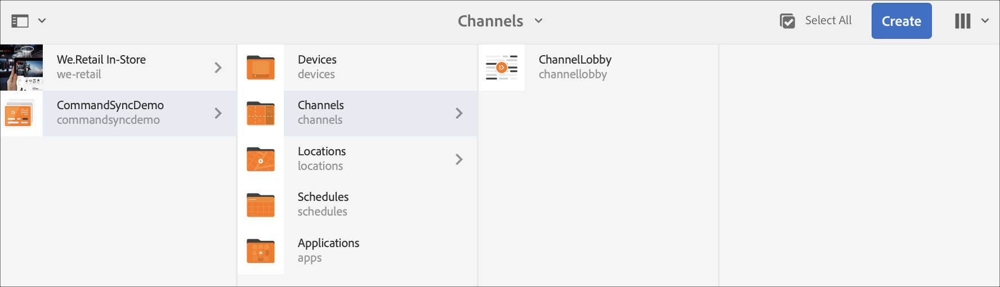

# Sincronizzazione comandi {#command-sync}

Nella pagina seguente viene descritto come utilizzare la sincronizzazione dei comandi. La sincronizzazione dei comandi consente la riproduzione sincronizzata tra diversi lettori. I lettori possono riprodurre contenuti diversi, ma ogni risorsa deve avere la stessa durata.

>[!IMPORTANT]
>
>Questa funzione non supporta le sequenze incorporate, le sequenze incorporate dinamiche, i canali di applicazione o le transizioni.

## Panoramica {#overview}

Le soluzioni di digital signage devono supportare le pareti video e la riproduzione sincronizzata per supportare scenari come i conteggi di Capodanno o grandi video suddivisi in sezioni per la riproduzione su schermi diversi, ed è qui che entra in gioco la sincronizzazione dei comandi.

Per utilizzare Command Sync, un lettore agisce come un *master* e invia il comando e tutti gli altri giocatori agiscono come *client* e vengono riprodotti quando ricevono il comando.

Il *master* invia un comando a tutti i client registrati quando sta per avviare la riproduzione di un elemento. Il payload di questo può essere l&#39;indice dell&#39;elemento da riprodurre e/o il codice HTML esterno dell&#39;elemento da riprodurre.

## Implementazione della sincronizzazione dei comandi {#using-command-sync}

La sezione seguente descrive come utilizzare la sincronizzazione dei comandi in un progetto AEM Screens .

>[!NOTE]
>
>Per la riproduzione sincronizzata, è necessario che tutti i dispositivi hardware abbiano le stesse specifiche hardware e preferibilmente lo stesso sistema operativo. Non è consigliabile sincronizzare tra diversi hardware e sistemi operativi.

### Impostazione del progetto {#setting-up}

Prima di usare la funzione di sincronizzazione dei comandi, accertatevi di disporre di un progetto e di un canale con il contenuto impostato per il progetto.

1. L&#39;esempio seguente mostra un progetto dimostrativo denominato **CommandSyncDemo** e un canale di sequenza **ChannelLobby**.

   

   >[!NOTE]
   >
   >Per informazioni su come creare un canale o aggiungere contenuti a un canale, fare riferimento a [Creazione e gestione di canali](/help/user-guide/managing-channels.md)

   Il canale contiene il seguente contenuto, come mostrato nella figura riportata di seguito.

   

1. Create una posizione **Lobby** e, successivamente, una visualizzazione denominata **LobbyDisplay** nella cartella **Locations**, come illustrato nella figura riportata di seguito.
   

1. Assegnare il canale, **ChannelLobby** al **LobbyDisplay**. È ora possibile visualizzare il canale assegnato al display dal pannello di visualizzazione.
   

   >[!NOTE]
   >
   >Per informazioni su come assegnare un canale a uno schermo, fare riferimento a [Creazione e gestione di display](/help/user-guide/managing-displays.md).

1. Andate alla cartella **Devices** e fate clic su **Device Manager** dalla barra delle azioni per registrare i dispositivi.

   

   >[!NOTE]
   >
   >Per informazioni su come registrare un dispositivo, fare riferimento a [Registrazione dispositivo](/help/user-guide/device-registration.md)

1. A scopo dimostrativo, questo esempio mostra un dispositivo chrome e un lettore Windows come due dispositivi separati. Entrambi i dispositivi puntano allo stesso display.
   

### Aggiornamento delle impostazioni del canale

1. Andate a **ChannelLobby** e fate clic su **Edit** dalla barra delle azioni per aggiornare le impostazioni del canale.

1. Selezionare l&#39;intero canale come mostrato nella figura seguente.
   

1. Fare clic sull&#39;icona chiave inglese per aprire la finestra di dialogo **Pagina**.
   

1. Immettere la parola chiave *synced* nel campo **Strategy**.

   

### Impostazione di un master {#setting-up-master}

1. Andate alla dashboard di visualizzazione da **CommandSyncDemo** —> **Locations** —> **Lobby** —> **LobbyDisplay** e fate clic su **Dashboard** dalla barra di azione.
Verranno visualizzati i due dispositivi (chrome e Windows player) nel pannello **DEVICES**, come illustrato nella figura seguente.
   

1. Dal pannello **DEVICES**, selezionare il dispositivo da impostare come principale. L&#39;esempio seguente illustra come impostare il dispositivo Chrome come principale. Fare clic su **Imposta come dispositivo principale**.

   

1. Immettete l&#39;indirizzo IP in **Imposta come dispositivo principale** e fate clic su **Salva**.

   

>[!NOTE]
>
>Potete impostare più dispositivi come principali.

### Sincronizzazione con Master {#sync-up-master}

1. Dopo aver impostato il dispositivo Chrome come master, è possibile sincronizzare l&#39;altro dispositivo (in questo caso, il lettore Windows) per sincronizzare con il master.
Selezionare l&#39;altro dispositivo (in questo caso, il lettore Windows) dal pannello **DEVICES** e fare clic su **Sincronizza con dispositivo master**, come mostrato nella figura seguente.

   

1. Selezionare il dispositivo dall&#39;elenco e fare clic su **Salva**.

   >[NOTA:]
   > La finestra di dialogo **Sincronizza con dispositivo principale** mostrerà l&#39;elenco dei dispositivi principali. Potete selezionare la preferenza desiderata.

1. Una volta che il dispositivo (lettore Windows) è sincronizzato con il master (lettore Chrome), il dispositivo verrà sincronizzato nel pannello **DEVICES**.

   

### Dissincronizzazione con il master {#desync-up-master}

Dopo aver sincronizzato uno o più dispositivi con uno schema, potete desincronizzare l’assegnazione da tale dispositivo.

>[!NOTE]
>
>Se desincronizzate un dispositivo master, verrà scollegato anche tutti i dispositivi client associati a tale dispositivo master.

Per rimuovere la sincronizzazione dalla periferica master, procedere come segue:

1. Andate al pannello **DEVICES** e selezionate il dispositivo.

1. Fare clic su **Disconnetti dispositivo/i** per desincronizzare il client dal dispositivo principale.

   

1. Fare clic su **Conferma** per desincronizzare il dispositivo selezionato dal master.

   >[NOTA:]
   > Se selezionate il dispositivo master e utilizzate l&#39;opzione di desincronizzazione, tutti i dispositivi connessi al master verranno desincronizzati in un unico passaggio.
