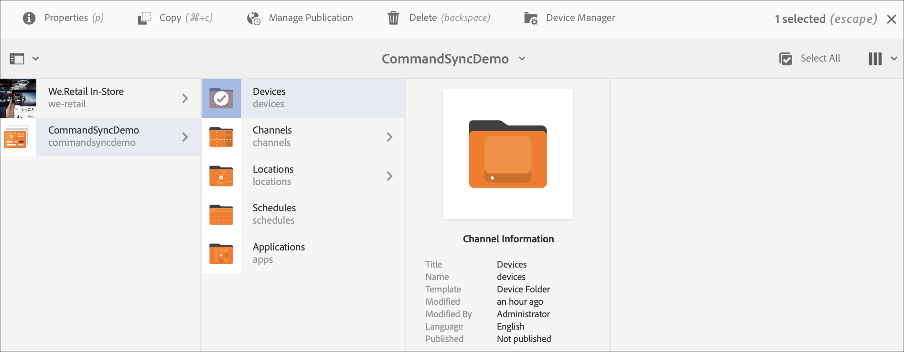
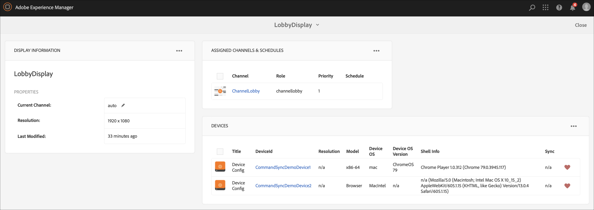

# Sincronizzazione comandi {#command-sync}

Nella pagina seguente viene descritto come utilizzare la sincronizzazione dei comandi. La sincronizzazione dei comandi consente la riproduzione sincronizzata tra diversi lettori. I lettori possono riprodurre contenuti diversi, ma ogni risorsa deve avere la stessa durata.

## Panoramica {#overview}

Le soluzioni di digital signage devono supportare le pareti video e la riproduzione sincronizzata per supportare scenari come i conteggi di Capodanno o grandi video suddivisi in sezioni per la riproduzione su schermi diversi, ed è qui che entra in gioco la sincronizzazione dei comandi.

Per utilizzare Command Sync, un giocatore agisce come *master* e invia il comando e tutti gli altri giocatori agiscono come *client* e giocano quando ricevono il comando.

Il *master* invia un comando a tutti i client registrati quando sta per avviare la riproduzione di un elemento. Il payload di questo può essere l&#39;indice dell&#39;elemento da riprodurre e/o il codice HTML esterno dell&#39;elemento da riprodurre.

## Implementazione della sincronizzazione dei comandi {#using-command-sync}

La sezione seguente descrive come utilizzare la sincronizzazione dei comandi in un progetto AEM Screens.

### Impostazione del progetto {#setting-up}

Prima di usare la funzione di sincronizzazione dei comandi, accertatevi di disporre di un progetto e di un canale con il contenuto impostato per il progetto.

1. L’esempio seguente mostra un progetto dimostrativo denominato **CommandSyncDemo** e un canale di sequenza **ChannelLobby**.

   

   >[!NOTE]
   >
   >Per informazioni su come creare un canale o aggiungere contenuti a un canale, consulta [Creazione e gestione di canali](/help/user-guide/managing-channels.md)

   Il canale contiene il contenuto seguente, come mostrato nella figura seguente.

   

1. Create una visualizzazione nella cartella **Locations (Posizioni)** , come illustrato nella figura riportata di seguito.
   

1. Assegna il canale, **ChannelLobby** al tuo **LobbyDisplay**.
   

   >[!NOTE]
   >
   >Per informazioni su come assegnare un canale a uno schermo, fare riferimento a [Creazione e gestione di schermi](/help/user-guide/managing-displays.md)

1. Andate alla cartella **Devices** e fate clic su **Device Manager** dalla barra delle azioni per registrare i dispositivi.

   

   >[!NOTE]
   >
   >Per informazioni su come assegnare un canale a uno schermo, fare riferimento a [Creazione e gestione di schermi](/help/user-guide/managing-displays.md)

1. A scopo dimostrativo, questo esempio mostra un dispositivo chrome e un lettore Web come due dispositivi separati. Entrambi i dispositivi puntano allo stesso display.
   

### Impostazione di una pagina master {#setting-up-master}

1. Andate alla dashboard di visualizzazione da **CommandSyncDemo** —> **Locations** —> **Lobby** —> **LobbyDisplay** e fate clic su **Dashboard** dalla barra delle azioni.
Verranno visualizzati i due dispositivi (chrome e Windows player) nel pannello **DISPOSITIVI** , come mostrato nella figura seguente.

   

1. Dal pannello **DISPOSITIVI** , selezionate il dispositivo da impostare come principale. L&#39;esempio seguente illustra come impostare il dispositivo Chrome come principale. Fate clic su **Imposta come dispositivo** principale.

   

1. Immettete l&#39;indirizzo IP in **Set as master device (Imposta come dispositivo** principale) e fate clic su **Save (Salva)**.

   

### Sincronizzazione con Master {#sync-up-master}

1. Dopo aver impostato il dispositivo Chrome come master, è possibile sincronizzare l&#39;altro dispositivo da sincronizzare con il master.
Selezionate l&#39;altro dispositivo dal pannello **DISPOSITIVI** e fate clic su **Sincronizza con dispositivo** principale, come illustrato nella figura seguente.

1. Selezionate il dispositivo dall’elenco e fate clic su **Salva**.

1. Passate al [Web Player](http://localhost:4502/screens/player.html).

