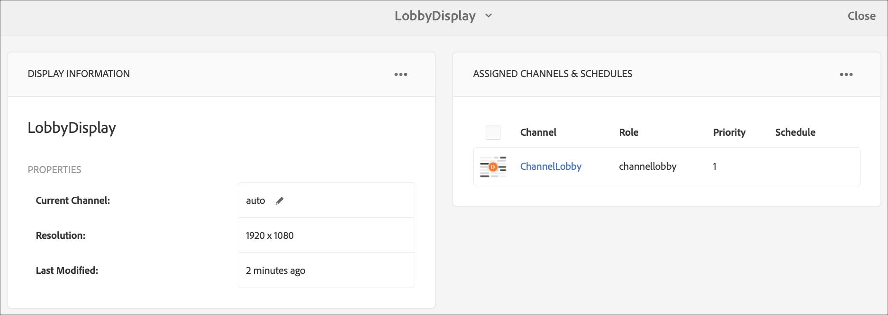

# Sincronizzazione dei comandi {#command-sync}

Nella pagina seguente viene descritto come utilizzare la sincronizzazione dei comandi. La sincronizzazione dei comandi consente la riproduzione sincronizzata tra lettori diversi. I lettori possono riprodurre contenuti diversi, ma ogni risorsa deve avere la stessa durata.

>[!IMPORTANT]
>
>Questa funzione non supporta le sequenze incorporate, le sequenze incorporate dinamiche, i canali di applicazione o le transizioni.

## Panoramica {#overview}

Le soluzioni di digital signage devono supportare le pareti video e la riproduzione sincronizzata per supportare scenari come i countdown di Capodanno o grandi video suddivisi in più schermi ed è qui che entra in gioco Command Sync.

Per utilizzare Command Sync, un lettore agisce come un *primario* e invia il comando e tutti gli altri giocatori agiscono come *client* e riproduci quando ricevono il comando.

La *primario* invia un comando a tutti i client registrati quando si sta per avviare la riproduzione di un elemento. Il payload di questo può essere l’indice dell’elemento da riprodurre e/o l’html esterno dell’elemento da riprodurre.

## Implementazione della sincronizzazione dei comandi {#using-command-sync}

Nella sezione seguente viene descritto come utilizzare Command Sync in un progetto AEM Screens.

>[!NOTE]
>
>Per la riproduzione sincronizzata, è necessario che tutti i dispositivi hardware abbiano le stesse specifiche hardware e preferibilmente lo stesso sistema operativo. La sincronizzazione tra diversi hardware e sistemi operativi non è consigliata.

### Impostazione del progetto {#setting-up}

Prima di utilizzare la funzione di sincronizzazione dei comandi, assicurati di disporre di un progetto e di un canale con il contenuto configurato per il progetto.

1. L’esempio seguente mostra un progetto demo denominato **CommandSyncDemo** e un canale a sequenza **CanaleLobby**.

   

   >[!NOTE]
   >
   >Per scoprire come creare un canale o aggiungere contenuti a un canale, consulta [Creazione e gestione dei canali](/help/user-guide/managing-channels.md)

   Il canale contiene il seguente contenuto, come illustrato nella figura riportata di seguito.

   

1. Creare una posizione **Lobby** e successivamente una visualizzazione con titolo come **LobbyDisplay** in **Posizioni** come illustrato nella figura riportata di seguito.
   

1. Assegna il canale, **CanaleLobby** al tuo **LobbyDisplay**. Ora puoi visualizzare il canale assegnato alla visualizzazione dal dashboard di visualizzazione.
   

   >[!NOTE]
   >
   >Per informazioni su come assegnare un canale a una visualizzazione, consulta [Creazione e gestione delle visualizzazioni](/help/user-guide/managing-displays.md).

1. Passa a **Dispositivi** e fai clic su **Gestione dispositivi** dalla barra delle azioni per registrare i dispositivi.

   

   >[!NOTE]
   >
   >Per informazioni su come registrare un dispositivo, consulta [Registrazione dei dispositivi](/help/user-guide/device-registration.md)

1. A scopo dimostrativo, questo esempio mostra un dispositivo chrome e un lettore Windows come due dispositivi separati. Entrambi i dispositivi puntano allo stesso display.
   

### Aggiornamento delle impostazioni del canale

1. Passa a **CanaleLobby** e fai clic su **Modifica** dalla barra delle azioni per aggiornare le impostazioni del canale.

1. Seleziona l&#39;intero canale come mostrato nella figura riportata di seguito.
   

1. Fai clic sull’icona a forma di chiave inglese per aprire la **Pagina** finestra di dialogo.
   

1. Inserisci il *sincronizzato* nelle **Strategia** campo .

   

### Impostazione di un {#setting-up-primary}

1. Passa al dashboard di visualizzazione da **CommandSyncDemo** —> **Posizioni**  —> **Lobby** —> **LobbyDisplay** e fai clic su **Dashboard** dalla barra delle azioni.
Verranno visualizzati i due dispositivi (chrome e windows player) in **DISPOSITIVI** come illustrato nella figura riportata di seguito.
   

1. Da **DISPOSITIVI** , seleziona il dispositivo da impostare come principale. L’esempio seguente illustra come impostare il dispositivo Chrome come principale. Fai clic su **Imposta come dispositivo principale**.

   

1. Immettere l&#39;indirizzo IP in **Imposta come dispositivo principale** e fai clic su **Salva**.

   

>[!NOTE]
>
>È possibile impostare più dispositivi come principali.

### Sincronizzazione con primario {#sync-up-primary}

1. Una volta impostato il dispositivo Chrome come primario, è possibile sincronizzare l&#39;altro dispositivo (in questo caso, il lettore Windows) per la sincronizzazione con il principale.
Seleziona l&#39;altro dispositivo (in questo caso, Windows Player) dal **DISPOSITIVI** fai clic su **Sincronizzazione con il dispositivo principale**, come illustrato nella figura seguente.

   

1. Seleziona il dispositivo dall’elenco e fai clic su **Salva**.

   >[NOTA:]
   > La **Sincronizzazione con il dispositivo principale** viene visualizzato l’elenco dei dispositivi principali. Puoi selezionare la preferenza desiderata.

1. Una volta che il dispositivo (Windows Player) è sincronizzato con il principale (Chrome Player), vedrai il dispositivo sincronizzato nel **DISPOSITIVI** pannello.

   

### Sincr. con il primario {#desync-up-primary}

Dopo aver sincronizzato uno o più dispositivi con un dispositivo primario, puoi desincronizzare l&#39;assegnazione da tale dispositivo.

>[!NOTE]
>
>Se si desincronizza un dispositivo primario, verranno scollegati anche tutti i dispositivi client associati a tale dispositivo primario.

Per rimuovere la sincronizzazione dal dispositivo principale, segui i passaggi seguenti:

1. Passa a **DISPOSITIVI** e seleziona il dispositivo.

1. Fai clic su **Dispositivi di sincronizzazione** per desincronizzare il client dal dispositivo principale.

   

1. Fai clic su **Conferma** per desincronizzare il dispositivo selezionato dal dispositivo primario.

   >[NOTA:]
   > Se selezioni il dispositivo principale e utilizzi l’opzione di desincronizzazione, tutti i dispositivi connessi al dispositivo primario verranno desincronizzati in un unico passaggio.
