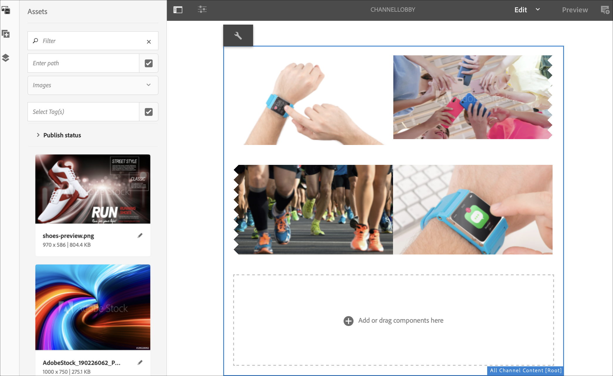
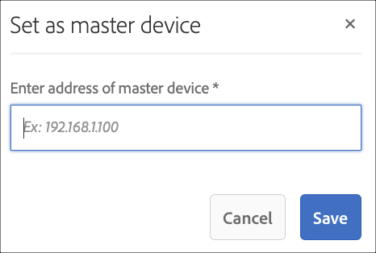

# Sincronizzazione dei comandi {#command-sync}

Nella pagina seguente viene descritto come utilizzare la sincronizzazione dei comandi. La sincronizzazione dei comandi consente la riproduzione sincronizzata tra lettori diversi. I lettori possono riprodurre contenuti diversi, ma ogni risorsa deve avere la stessa durata.

>[!IMPORTANT]
>
>Questa funzione non supporta le sequenze incorporate, le sequenze incorporate dinamiche, i canali di applicazione o le transizioni.

## Panoramica {#overview}

Le soluzioni di digital signage devono supportare le pareti video e la riproduzione sincronizzata per supportare scenari come i countdown di Capodanno o grandi video affettati per la riproduzione su più schermi ed è qui che entra in gioco Command Sync.

Per utilizzare Command Sync, un lettore agisce come un *master* e invia un comando e tutti gli altri giocatori agiscono come *client* e si riproducono quando ricevono il comando.

Il *master* invia un comando a tutti i client registrati quando sta per avviare la riproduzione di un elemento. Il payload di questo può essere l’indice dell’elemento da riprodurre e/o l’html esterno dell’elemento da riprodurre.

## Implementazione della sincronizzazione dei comandi {#using-command-sync}

Nella sezione seguente viene descritto come utilizzare Command Sync in un progetto AEM Screens.

>[!NOTE]
>
>Per la riproduzione sincronizzata, è necessario che tutti i dispositivi hardware abbiano le stesse specifiche hardware e preferibilmente lo stesso sistema operativo. La sincronizzazione tra diversi hardware e sistemi operativi non è consigliata.

### Configurazione del progetto {#setting-up}

Prima di utilizzare la funzione di sincronizzazione dei comandi, assicurati di disporre di un progetto e di un canale con il contenuto configurato per il progetto.

1. L&#39;esempio seguente illustra un progetto demo denominato **CommandSyncDemo** e un canale di sequenza **ChannelLobby**.

   

   >[!NOTE]
   >
   >Per informazioni su come creare un canale o aggiungere contenuti a un canale, consulta [Creazione e gestione di canali](/help/user-guide/managing-channels.md)

   Il canale contiene il seguente contenuto, come illustrato nella figura riportata di seguito.

   

1. Crea una posizione **Lobby** e successivamente una visualizzazione denominata **LobbyDisplay** nella cartella **Posizioni**, come illustrato nella figura riportata di seguito.
   

1. Assegna il canale **ChannelLobby** al **LobbyDisplay**. Ora puoi visualizzare il canale assegnato alla visualizzazione dal dashboard di visualizzazione.
   

   >[!NOTE]
   >
   >Per informazioni su come assegnare un canale a una visualizzazione, consulta [Creazione e gestione di visualizzazioni](/help/user-guide/managing-displays.md).

1. Passa alla cartella **Dispositivi** e fai clic su **Gestione dispositivi** nella barra delle azioni per registrare i dispositivi.

   

   >[!NOTE]
   >
   >Per informazioni su come registrare un dispositivo, consulta [Registrazione del dispositivo](/help/user-guide/device-registration.md)

1. A scopo dimostrativo, questo esempio mostra un dispositivo chrome e un lettore Windows come due dispositivi separati. Entrambi i dispositivi puntano allo stesso display.
   

### Aggiornamento delle impostazioni del canale

1. Passa a **ChannelLobby** e fai clic su **Modifica** nella barra delle azioni per aggiornare le impostazioni del canale.

1. Seleziona l&#39;intero canale come mostrato nella figura riportata di seguito.
   

1. Fai clic sull&#39;icona a forma di chiave inglese per aprire la finestra di dialogo **Pagina** .
   

1. Immetti la parola chiave *sincronizzata* nel campo **Strategia** .

   

### Impostazione di un master {#setting-up-master}

1. Passa al dashboard di visualizzazione da **CommandSyncDemo** —> **Posizioni** —> **Lobby** —> **LobbyDisplay** e fai clic su **Dashboard** dalla barra delle azioni.
I due dispositivi (chrome e windows player) vengono visualizzati nel pannello **DISPOSITIVI**, come illustrato nella figura riportata di seguito.
   

1. Dal pannello **DISPOSITIVI**, seleziona il dispositivo da impostare come master. L’esempio seguente illustra come impostare il dispositivo Chrome come master. Fai clic su **Imposta come dispositivo master**.

   

1. Inserisci l&#39;indirizzo IP in **Imposta come dispositivo master** e fai clic su **Salva**.

   

>[!NOTE]
>
>È possibile impostare più dispositivi come master.

### Sincronizzazione con Master {#sync-up-master}

1. Una volta impostato il dispositivo Chrome come master, è possibile sincronizzare l&#39;altro dispositivo (in questo caso, il lettore Windows) per la sincronizzazione con il master.
Seleziona l&#39;altro dispositivo (in questo caso, windows player) dal pannello **DISPOSITIVI** e fai clic su **Sincronizza con dispositivo master**, come illustrato nella figura riportata di seguito.

   

1. Seleziona il dispositivo dall&#39;elenco e fai clic su **Salva**.

   >[NOTA:]
   > La finestra di dialogo **Sincronizza con dispositivo master** mostrerà l&#39;elenco dei dispositivi master. Puoi selezionare la preferenza desiderata.

1. Una volta che il dispositivo (Windows Player) è sincronizzato con il master (Chrome Player), il dispositivo verrà sincronizzato nel pannello **DISPOSITIVI**.

   

### Dissincronizzazione con il master {#desync-up-master}

Dopo aver sincronizzato un dispositivo o i dispositivi su un master, è possibile desincronizzare l&#39;assegnazione da tale dispositivo.

>[!NOTE]
>
>Se si desincronizza un dispositivo master, verranno scollegati anche tutti i dispositivi client associati a tale dispositivo master.

Per rimuovere la sincronizzazione dal dispositivo master, segui i passaggi seguenti:

1. Passa al pannello **DISPOSITIVI** e seleziona il dispositivo.

1. Fai clic su **Disconnetti dispositivo** per desincronizzare il client dal dispositivo master.

   

1. Fai clic su **Conferma** per desincronizzare il dispositivo selezionato dal master.

   >[NOTA:]
   > Se si seleziona il dispositivo master e si utilizza l&#39;opzione di desincronizzazione, tutti i dispositivi collegati al master verranno desincronizzati in un unico passaggio.
