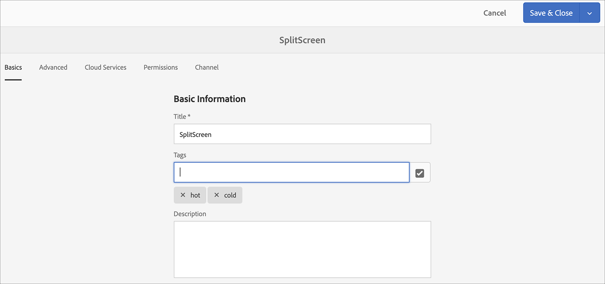

# Riconoscimento vocale in AEM Screens {#voice-recognition}

>[!IMPORTANT]
>
>**Informazioni importanti sulla privacy**
>
>Quando utilizzi la funzione di riconoscimento vocale, segui tutte le linee guida legali ed etiche applicabili per la tua regione. Queste linee guida includono, tra l’altro, un avviso visibile agli utenti finali che il lettore sta utilizzando il riconoscimento vocale. Adobe non riceve, archivia o elabora le informazioni relative alla voce. I lettori AEM Screens utilizzano l’API di riconoscimento vocale web standard incorporata nel motore di navigazione. Dietro le quinte, questa API invia una forma ondulata del discorso ai server di Google per la conversione da discorso a testo. Il lettore confronta il testo con le parole chiave configurate.
>
>Per ulteriori dettagli, vedere il [White paper sulla privacy di Google sull&#39;API di riconoscimento vocale Web](https://www.google.com/chrome/privacy/whitepaper.html#speech).

La funzione di riconoscimento vocale consente la modifica del contenuto in un canale AEM Screens guidata dall’interazione vocale.

Un autore di contenuti può configurare una visualizzazione in modo che sia abilitata per la voce. Lo scopo di questa funzione è quello di consentire ai clienti di utilizzare la sintesi vocale come metodo di interazione con i loro display. Alcuni casi d’uso simili includono la ricerca di prodotti consigliati nei negozi, l’ordine di voci di menu in ristoranti e ristoranti. Questa funzione aumenta l’accessibilità per gli utenti e può migliorare notevolmente l’esperienza del cliente.

>[!NOTE]
>L&#39;hardware del lettore deve supportare l&#39;input vocale, ad esempio un microfono.

## Implementazione del riconoscimento vocale {#implementing}

>[!IMPORTANT]
> La funzione di riconoscimento vocale è disponibile solo sui lettori Chrome OS e Windows.

Per implementare il riconoscimento vocale nel progetto AEM Screens, abilita il riconoscimento vocale per lo schermo e associa ciascun canale a un tag univoco per attivare una transizione di canale.

Nella sezione seguente viene descritto come abilitare e utilizzare la funzione di riconoscimento vocale in un progetto AEM Screens.

## Visualizzazione del contenuto nel passaggio di canale Schermo intero o Schermo diviso {#sequence-channel}

Prima di utilizzare una funzione di riconoscimento vocale, accertati di disporre di un progetto e di un canale con contenuti impostati per il progetto.

1. Nell&#39;esempio seguente viene illustrato un progetto demo denominato **VoiceDemo** e tre canali di sequenza **Main**, **ColdDrinks** e **HotDrinks**, come illustrato nella figura seguente.

   

   >[!NOTE]
   >
   >Per informazioni su come creare un canale o aggiungere contenuto a un canale, vedere [Creazione e gestione di canali](/help/user-guide/managing-channels.md)

   Oppure

   È possibile creare tre canali di sequenza **Main**, **ColdDrinks** e **HotDrinks** e un altro canale Screens diviso 1x2 **SplitScreen** come illustrato nella figura seguente.

   

1. Passa a ciascuno dei canali e aggiungi il contenuto. Ad esempio, passa a **VoiceDemo** > **Canali** > **Principale** e fai clic sul canale. Fai clic su **Modifica** nella barra delle azioni, quindi aggiungi contenuto (immagini/video) in base alle tue esigenze. Allo stesso modo, aggiungi contenuto sia al canale **ColdDrinks** che al canale **HotDrinks**.

   I canali ora contengono risorse (immagini), come illustrato nelle figure riportate di seguito.

   **Principale**:

   

   **ColdDrinks**:

   

   **HotDrinks**:

   

   Se hai aggiunto il canale Split Screens al progetto, passa a **SplitScreen** e trascina due sequenze incorporate. Aggiungi percorsi al canale **ColdDrinks** e **HotDrinks** come illustrato nella figura seguente.
   

### Impostazione dei tag per i canali {#setting-tags}

Dopo aver aggiunto il contenuto ai canali, passa a ciascuno di essi e aggiungi i tag appropriati che attiverebbero il riconoscimento vocale.

Per aggiungere tag al canale, segui la procedura riportata di seguito:

1. Passa a ciascuno dei canali e aggiungi il contenuto. Ad esempio, passa a **VoiceDemo** > **Canali** > **Principale** e fai clic sul canale.

1. Fare clic su **Proprietà** nella barra delle azioni.

   

1. Passa alla scheda **Nozioni di base**, quindi fai clic su un tag esistente nel campo **Tag** oppure creane uno.

   Puoi creare un tag digitando un nuovo nome per il tag e premendo il tasto `return`, come illustrato nella figura seguente:

   

   Oppure

   Puoi anche creare tag dall’istanza AEM in anticipo per il progetto e selezionarli. Dopo aver seguito i passaggi descritti in [Creazione di tag](#creating-tags), è possibile fare clic sul tag dalla posizione e aggiungerlo al canale, come illustrato nella figura seguente:

   

1. Allo stesso modo, aggiungi un tag con titolo **hot** al canale **HotDrinks**.

1. Se utilizzi un canale Split Screens, aggiungi entrambi i tag (**hot** e **cold**) alle proprietà del canale **SplitScreen**, come illustrato nella figura seguente.

   

1. Al termine, fai clic su **Salva e chiudi**.

### Creazione di tag {#creating-tags}

Per creare i tag, segui i passaggi seguenti:

1. Passa all’istanza AEM.

1. Fai clic sull&#39;icona Strumenti > **Assegnazione tag**.
   

1. Fai clic su **Crea** > **Crea spazio dei nomi**.
   

1. Immetti il nome del progetto, ad esempio **Demo vocale** e fai clic su **Crea**.

1. Fai clic sul progetto **VoiceDemo** e fai clic su **Crea tag** nella barra delle azioni.
   

1. Immetti il nome del tag e fai clic su **Invia**.
   

Ora puoi utilizzare questi tag nel tuo progetto AEM Screens.

### Assegnazione di un canale a un display e attivazione del riconoscimento vocale {#channel-assignment}

1. Crea una visualizzazione nella cartella **Percorsi**, come illustrato nella figura seguente.

   

   >[!NOTE]
   >Per informazioni su come assegnare un canale a una visualizzazione, vedere [Creazione e gestione di visualizzazioni](/help/user-guide/managing-displays.md).

1. Assegna i canali **Principale**, **ColdDrinks** e **HotDrinks** al tuo **LobbyDisplay**. Inoltre, se utilizzi il canale **SplitScreen** per il progetto, assicurati di assegnarlo anche alla visualizzazione.

   >[!NOTE]
   >Se hai creato un canale schermo diviso, assegna il canale **SplitScreen** anche alla tua visualizzazione.

1. Durante l&#39;assegnazione del canale, impostate le seguenti proprietà su ciascun canale.

   | **Nome canale** | **Priorità** | **Eventi supportati** |
   |---|---|---|
   | Principale | 2 | Caricamento iniziale, schermata di inattività, timer |
   | HotDrinks | 1 | Interazione utente |
   | ColdDrinks | 1 | Interazione utente |
   | SplitScreen | 1 | Interazione utente |

   >[!NOTE]
   >
   >Per informazioni su come assegnare un canale a una visualizzazione, vedere [Creazione e gestione di visualizzazioni](/help/user-guide/managing-displays.md).

1. Dopo aver assegnato i canali a una visualizzazione, passa a **LobbyDisplay** e fai clic sulla visualizzazione. Fare clic su **Proprietà** nella barra delle azioni.

1. Passa alla scheda **Visualizzazione** e abilita l&#39;opzione **Voce abilitata** in **Contenuto**.

   

   >[!IMPORTANT]
   >È obbligatorio attivare la funzione di riconoscimento vocale dal display.

### Visualizzazione del contenuto nel lettore Chrome {#viewing-content}

Una volta completati i passaggi precedenti, è possibile registrare il dispositivo Chrome per visualizzare l&#39;output.

>[!NOTE]
>Consulta [Registrazione dispositivo](device-registration.md).

**Output desiderato per il canale sequenza**

Il canale **Principale** sta riproducendo il relativo contenuto. Tuttavia, quando si utilizzano parole con la parola chiave **hot**, ad esempio *Vorrei avere una bevanda calda*, il canale inizia a riprodurre il contenuto del canale **HotDrinks**.

Analogamente, se utilizzi una parola con una parola chiave **cold** come *Vorrei avere qualcosa cold*, il canale inizia a riprodurre il contenuto del canale **ColdDrinks**.

**Output desiderato per il canale Screens diviso**

Il canale **Principale** sta riproducendo il relativo contenuto. Tuttavia, quando si utilizzano parole con la parola chiave **hot** e **cold** insieme, ad esempio *Desidero visualizzare il menu per le bevande calde e fredde*, il canale riproduce il contenuto del canale **SplitScreen**. Se *torna al menu principale*, verrà ripristinato il canale **Principale**.
