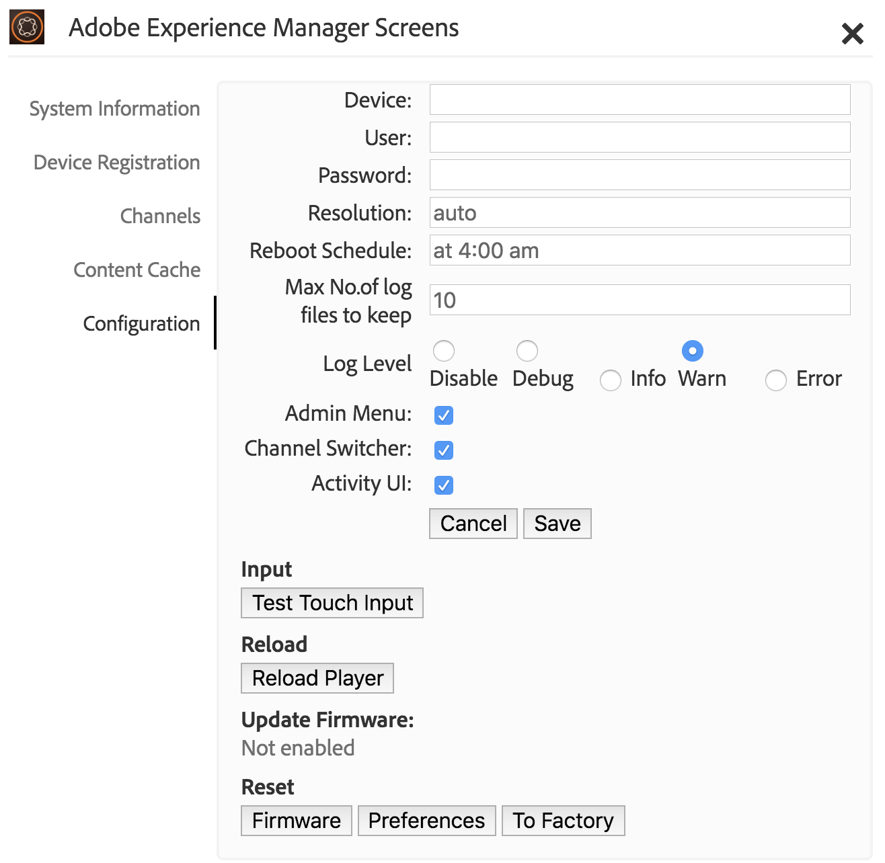

# Working with AEM Screens Player {#working-with-aem-screens-player}

Puoi gestire il contenuto del canale e altre impostazioni su AEM Screens Player.

>[!NOTE]
>
>Premi ***Ctrl+Cmd+F**per uscire dalla modalità a schermo intero per OS X di AEM Screens Player.*

Una volta assegnato un canale a una visualizzazione, AEM Screens Player mostra il contenuto. Puoi configurare le impostazioni per il lettore utilizzando le preferenze per l'interfaccia utente dell'amministratore (dal dashboard) o dal lettore stesso.

## Utilizzo del dashboard del dispositivo {#using-the-device-dashboard}

Puoi configurare le preferenze per il dispositivo dal dashboard del dispositivo, accessibile tramite l'istanza di creazione AEM.

1. Navigate to the device dashboard from your project, for example, ***Test Project*** --&gt; ***Devices***.

   Select **Devices** and **Device Manager** from the action bar.

   

1. Fai clic sul dispositivo per aprire il dashboard del dispositivo.

   

1. Check the **PREFERENCES** panel. You can enable/disable the **Admin UI** and **Channel Switcher** for your player from these two options.

   

### Interfaccia utente amministratore {#the-admin-ui}

Enabling the **Admin UI** from the preferences panel allows the user to open the admin settings from the Screens Player. Inoltre, disabilitando questa opzione dal dashboard del dispositivo, l'utente non può aprire l'interfaccia utente dell'amministratore dal lettore.

Per visualizzare l'interfaccia utente dell'amministratore da Screens Player, tieni premuto nell'angolo in alto a sinistra per aprire il menu dell'amministratore, su AEM Screens Player abilitato al tocco o utilizzando il mouse. Mostra le informazioni dopo che la registrazione è stata completata e i canali sono stati caricati.

>[!NOTE]
>
>Inoltre, puoi visualizzare il tempo di attività dell'applicazione AEM Screens Player per controllare lo stato dell'applicazione.

Se si seleziona l'opzione **Configurazione** dal menu laterale, da questa finestra di dialogo è possibile reimpostare **firmware**, **preferenze** o **su fabbrica** .

Inoltre, potete specificare il numero massimo di file di registro da conservare per un lettore AEM Screens in Numero **massimo. dei file di registro da mantenere**. Per maggiori informazioni, consulta la schermata sottostante.

>[!NOTE]
>
>L'opzione **Aggiorna firmware** funziona solo sulla cordova, come i lettori Android.

>[!NOTE]
>
>Si consiglia di disabilitare l'interfaccia utente **** Amministratore nelle installazioni di produzione.

Puoi cancellare la cache per i canali e le applicazioni dall'interfaccia utente dell'amministratore in AEM Screens Player.

Seleziona la **Cache del contenuto** dalla guida laterale per aggiornare la cache.

### Controllo canali {#the-channel-switcher}

Enabling the **Channel Switcher** from the preferences panel allows the user to open the channel selection/settings from the Screens Player.

Inoltre, disabilitando questa opzione dal dashboard del dispositivo, l'utente non può controllare le preferenze dei canali da Screens Player.

Puoi cambiare e controllare le impostazioni per il canale da Screens Player.

Per visualizzare il controllo canali dal lettore, tenere premuto a lungo nell'angolo in basso a sinistra per aprire il controllo canali che consente di passare da un canale all'altro e ad altre funzioni.

>[!NOTE]
>
>Puoi anche attivare o disattivare il menu dell'amministratore e il controllo canali per il lettore da Screens Player.
>
>(Consulta *Modifica preferenze da Screens Player* come menzionato nella sezione di seguito).

### Gestione delle preferenze da AEM Screens Player {#managing-preferences-from-the-aem-screens-player}

Puoi anche modificare le impostazioni per l'interfaccia utente dell'amministratore e il controllo canali dal lettore stesso.

Segui questi passaggi per modificare le preferenze dal lettore:

1. Tieni premuto sull'angolo in alto a sinistra del canale inattivo per aprire il pannello di amministrazione.
1. Navigate to **Configuration** from the left action menu.
1. Enable/disable configuration for **Admin UI** or **Channel Switcher**.

## Risoluzione problemi con AEM Screens Player {#troubleshooting-aem-screens-player}

Puoi risolvere molti problemi associati ad AEM Screens Player (hardware e software):

| **Edizioni** | **Consigli** |
|---|---|
| Archiviazione del lettore completa | Eliminare i file non necessari |
| Rete persa dal lettore | Utilizzare il cavo Cat-5/Cat-6. Per il wifi, ridurre la distanza dal router alla periferica del lettore |
| Arresto anomalo di AEM Screens Player | È consigliabile disporre di un'app di controllo che assicuri l'esecuzione costante di AEM Screens Player |
| AEM Screens Player - Impostazioni perse | Controllare la connessione al server AEM |
| AEM Screens Player non si avvia automaticamente dopo il riavvio o il riavvio del lettore | Controllare la cartella iniziale del sistema operativo o la procedura di inizializzazione |
| AEM Screens Player visualizza contenuto errato/vecchio | Verifica connessione di rete |

### Aggiornamenti per AEM Screens Player {#updates-for-aem-screens-player}

Esistono due tipi di aggiornamenti per AEM Screens Player:

| **Metodo** | **Dettagli** | **tramite telecomando** | **Automatico** | **0 Download** |
|---|---|---|---|---|
| Aggiornamento firmware | Applicato ai lettori installati esistenti tramite il comando remoto. Dopo l'aggiornamento il lettore si caricherà automaticamente con il contenuto esistente. | Sì | Personalizzata | Quasi 1-3 secondi |
| Aggiornamenti shell Player | Si tratta di un nuovo eseguibile da distribuire sul lettore. Questo tipo di operazione richiede la copia remota del nuovo binario sul lettore, l'arresto dell'esecuzione in corso e l'avvio della nuova versione. Questo potrebbe richiedere un nuovo download del precaricamento dei pacchetti. | Sì (tramite shell remota) | Personalizzata | No |

## Linee guida sulla selezione hardware per il dispositivo di riproduzione {#hardware-selection-guidelines-for-player-device}

La sezione seguente illustra le linee guida per la selezione dell'hardware per un progetto Screens:

* Produrre sempre componenti ***commerciali*** o ***industriali*** sia per il lettore PC che per il pannello di visualizzazione o per il proiettore.

* Interagisci sempre con i fornitori che operano nel mercato del digital signage.
* Considerare sempre fattori ambientali come la temperatura ambiente e l'umidità relativa.
* Controllare sempre i requisiti di alimentazione e il condizionamento.
* Esaminare attentamente le esigenze di prestazioni e le porte I/O necessarie per l'applicazione.

Nella tabella seguente sono riepilogate le configurazioni hardware con i casi di utilizzo tipici per un progetto AEM Screens:

<table>
 <tbody>
  <tr>
   <td>Configurazione del lettore</td>
   <td>Processore</td>
   <td>Memoria</td>
   <td>SSD di storage</td>
   <td>GPU</td>
   <td>Visualizzazione</td>
   <td>I/O</td>
   <td>Casi di utilizzo tipici</td>
  </tr>
  <tr>
   <td>Base</td>
   <td>Processore Intel® Atom dual-core, i3 o quad-core entry-level</td>
   <td>
4 GB di memoria
 
2 MB di cache
 </td>
   <td>
・ ChromeOS 32 GB
 
・ Windows 128 GB
 </td>
   <td>OnBoard</td>
   <td>1920x1080</td>
   <td>DVI,  Ethernet / Wireless,  2 x USB</td>
   <td>
    <ul>
     <li>Ciclo a schermo intero standard  </li>
     <li>Frazionamento</li>
    </ul> </td>
  </tr>
  <tr>
   <td>Standard</td>
   <td>Processore quad core, Intel® Core i5</td>
   <td>
8 GB di memoria
 
4 MB di cache
 </td>
   <td>128 GBB</td>
   <td>OnBoard</td>
   <td>3840x2160 (4K)</td>
   <td>DVI, HDMI  Ethernet / Wireless,  2 x USB</td>
   <td>
    <ul>
     <li>Contenuto dinamico sorgente singola</li>
     <li>Semplice interattivo</li>
     <li>1-3 Layout delle aree</li>
    </ul> </td>
  </tr>
  <tr>
   <td>Avanzate</td>
   <td>Quad Core con hyperthreading, processore Intel® Core i7</td>
   <td>
16 GB di memoria
 
8 MB di cache
 </td>
   <td>256 GB</td>
   <td>GPU grafica dedicata</td>
   <td>3840x2160 (4K)</td>
   <td>DVI, HDMI  Ethernet / Wireless,  4 x USB</td>
   <td>
    <ul>
     <li>4 o più aree contenuto, riproduzione video simultanea</li>
     <li>Interattivo multipagina</li>
     <li>Attivatori di dati multi-sorgente</li>
    </ul> </td>
  </tr>
 </tbody>
</table>
